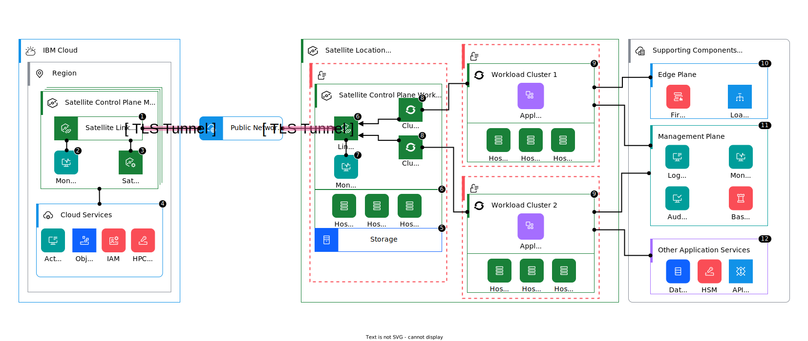
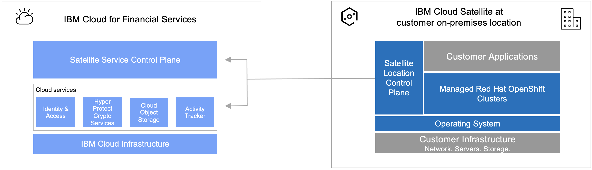

---

copyright:
  years: 2020, 2022
lastupdated: "2022-07-28"

keywords: 

subcollection: framework-financial-services

---

{{site.data.keyword.attribute-definition-list}}

# {{site.data.keyword.satelliteshort}} reference architecture for {{site.data.keyword.cloud_notm}} for Financial Services
{: #satellite-architecture-about}

With [{{site.data.keyword.satellitelong_notm}}](/docs/satellite), you can create a hybrid environment that brings the scalability and on-demand flexibility of public cloud services to the applications and data that run in your secure private cloud. The {{site.data.keyword.satelliteshort}} reference architecture for the {{site.data.keyword.cloud_notm}} for Financial Services is designed to provide a framework for building {{site.data.keyword.satelliteshort}}-based solutions by using a [shared responsibility model](/docs/allowlist/framework-financial-services?topic=framework-financial-services-satellite-architecture-shared-responsibilities) to fulfill the [best practices and requirements](/docs/allowlist/framework-financial-services?topic=framework-financial-services-best-practices) of the {{site.data.keyword.framework-fs_notm}}. This document describes the architecture and provides guidance for deploying, configuring, and managing it.
{: shortdesc}

{{site.data.keyword.satelliteshort}} achieves this distributed cloud architecture by providing an API-based suite of tools that you can use to represent your on-premises data center, a public cloud provider, or an edge network as a {{site.data.keyword.satelliteshort}} location. You fill the {{site.data.keyword.satelliteshort}} location with your own host machines that meet the [minimum host requirements](/docs/satellite?topic=satellite-host-reqs). Then, these hosts provide the compute power to run {{site.data.keyword.cloud_notm}} services, such as workloads in managed {{site.data.keyword.redhat_openshift_notm}} clusters. 

## Solution design
{: #satellite-solution}

When combined with other {{site.data.keyword.cloud_notm}} services that run in the cloud and other applications in your on-premises environment, the hybrid architecture of {{site.data.keyword.satelliteshort}} can be used to build robust solutions that are appropriate for financial and other regulated workloads. This hybrid architecture is shown in the following diagram.

{: caption="Figure 1. High-level {{site.data.keyword.satelliteshort}} reference architecture for {{site.data.keyword.cloud_notm}} for Financial Services" caption-side="bottom"}

The following table provides an index to the components in the diagram.

| {{site.data.keyword.cloud_notm}} | {{site.data.keyword.satelliteshort}} location on-premises | Supporting components on-premises |
|-----------------|-----------------------|-----------------|
| &#8291;1. [{{site.data.keyword.satelliteshort}} link tunnel server](#components-ibm-cloud) | &#8291;5. [Storage](#components-satellite-location-infrastructure-components) | &#8291;11. [Edge plane](#components-other-supporting) |
| &#8291;2. [Monitoring](#components-ibm-cloud) | &#8291;6. [{{site.data.keyword.satelliteshort}} hosts](#components-satellite-location-infrastructure-components) | &#8291;12. [Management plane](#components-other-supporting) |
| &#8291;3. [{{site.data.keyword.satelliteshort}} Config](#components-ibm-cloud)              | &#8291;7. [Link connector](#components-satellite-location-control-plane-workers)                             | &#8291;13. [Other application services](#components-other-supporting) |
| &#8291;4. [{{site.data.keyword.cloud_notm}} services](#financial-services-validated-services) | &#8291;8. [Monitoring](#components-satellite-location-control-plane-workers) | |
|                                                                      | &#8291;9. [Cluster 1 master](#components-satellite-location-control-plane-workers) \n &#8291;9. [Cluster 2 master](#components-satellite-location-control-plane-workers) | |
|                                                                      | &#8291;10. [Workload cluster 1](#components-satellite-location-workload-clusters) \n &#8291;10. [Workload cluster 2](#components-satellite-location-workload-clusters) | |
{: summary="Index of components in the {{site.data.keyword.satelliteshort}} reference architecture diagram"}
{: caption="Table 2. Index of components in the {{site.data.keyword.satelliteshort}} reference architecture diagram" caption-side="top"}

{{site.data.keyword.satelliteshort}} also supports deployments to other public cloud providers. However, we do not explore that feature in this reference architecture.
{: note}

## Financial Services Validated services
{: #financial-services-validated-services}

The reference architecture depends upon services that are [{{site.data.keyword.cloud_notm}} for Financial Services Validated](https://cloud.ibm.com/catalog?search=label%3Afs_ready){: external}. These services are designated to have evidenced compliance to the controls of the {{site.data.keyword.framework-fs_notm}}. Financial Services Validated services are designed to help address the requirements of financial institutions for regulatory compliance, security, and resiliency.

When properly configured and managed, services that are Financial Services Validated work together so you can deliver a solution that conforms to the best practices of the {{site.data.keyword.framework-fs_notm}}. The following table shows the required services that are included in the {{site.data.keyword.satelliteshort}} reference architecture and the complementary optional services that are available.

{{site.data.content.fs-validated-disclaimer-important}}

| Category | Required services | Optional services |
|----------|-------------------|-------------------|
| {{site.data.keyword.satelliteshort}}  | - [{{site.data.keyword.satellitelong}}](#services-core-satellite) |  |
| Containers | - [{{site.data.keyword.openshiftlong}}](#services-containers-openshift) [^tabletext-satellite-enabled-openshift] \n - [{{site.data.keyword.registrylong}}](#services-containers-registry) | |
| Storage  | - [{{site.data.keyword.cos_full}}](#services-storage-cos)   |    |
| Security  | - [{{site.data.keyword.cloud}} {{site.data.keyword.hscrypto}}](#services-security-hpcs)  | - [{{site.data.keyword.appid_full}}](#services-security-app-id)    |
| Logging and monitoring  | - [{{site.data.keyword.atracker_full}}](#services-logging-platform-events)[^tabletext] \n - [{{site.data.keyword.compliance_full}}](#services-scc) [^tabletext-not-yet-validated] | |
| Integration  |  | - [{{site.data.keyword.messagehub_full}}](#services-integration-event-streams)       |
| Databases  |  | - [{{site.data.keyword.ihsdbaas_mongodb_full}}](#services-databases-ihsdbaas_mongodb) \n - [{{site.data.keyword.ihsdbaas_postgresql_full}}](#services-databases-ihsdbaas_postgresql)  |
{: caption="Table 2. Required and optional services for {{site.data.keyword.satelliteshort}} reference architecture" caption-side="top"}

[^tabletext]: {{site.data.content.event-routing-fs-validation}}

[^tabletext-satellite-enabled-openshift]: {{site.data.content.satellite-enabled-openshift}}

[^tabletext-not-yet-validated]: {{site.data.content.not-yet-validated}}

The remainder of the topic goes into more detail about how these services fit into the reference architecture.

### Core
{: #services-core}

#### {{site.data.keyword.satellitelong_notm}}
{: #services-core-satellite}

Most of the services that are mentioned run entirely in {{site.data.keyword.cloud_notm}} but two exceptions:

- {{site.data.keyword.satelliteshort}}, which as described earlier, has some components that run in {{site.data.keyword.cloud_notm}} and some components that run in your {{site.data.keyword.satelliteshort}} location.
- {{site.data.keyword.openshiftshort}}, which refers to the {{site.data.keyword.openshiftshort}}-enabled type of the service, runs in your {{site.data.keyword.satelliteshort}} location.

These exceptions have implications for what it means to be Financial Services Validated and that is represented in the following diagram and details. 

{: caption="Figure 2. Financial Services Validated components in the {{site.data.keyword.satelliteshort}} reference architecture" caption-side="bottom"}

- {{site.data.keyword.satelliteshort}} components that run in {{site.data.keyword.cloud_notm}} are validated to the same {{site.data.keyword.framework-fs_notm}} controls as any other Financial Services Validated product.
- {{site.data.keyword.satelliteshort}} components and {{site.data.keyword.cloud_notm}} services that run in your on-premises environment that do not have a dependency on your configuration or underlying internal network and infrastructure components, are also validated to the applicable controls that were validated for these components in {{site.data.keyword.cloud_notm}}.
- On-premises infrastructure and your on-premises workloads are your responsibility and are not validated by {{site.data.keyword.IBM_notm}}. You are responsible for managing infrastructure and physical controls and controls that are related to deployment, configuration, and management of your workloads.

Several [{{site.data.keyword.satelliteshort}}-enabled services](/docs/satellite?topic=satellite-managed-services) can run in your {{site.data.keyword.satelliteshort}} location. However, only {{site.data.keyword.openshiftshort}} is Financial Services Validated. So, the others are not yet part of this reference architecture.
{: note}

### Containers
{: #services-containers}

#### {{site.data.keyword.openshiftlong_notm}} 
{: #services-containers-openshift}

You use [{{site.data.keyword.openshiftlong_notm}}](/docs/openshift?topic=openshift-roks-overview) to run your application workloads in your {{site.data.keyword.satelliteshort}} location. {{site.data.content.service-description-openshift}}

#### {{site.data.keyword.registrylong_notm}} 
{: #services-containers-registry}

{{site.data.content.service-description-container-registry}}

### Storage
{: #services-storage}

#### {{site.data.keyword.cos_full_notm}}
{: #services-storage-cos}

{{site.data.content.service-description-cloud-object-storage-1}}

{{site.data.content.service-description-cloud-object-storage-2}}

### Security
{: #services-security}

#### {{site.data.keyword.cloud_notm}} {{site.data.keyword.hscrypto}}
{: #services-security-hpcs}

{{site.data.content.service-description-hpcs}}

#### {{site.data.keyword.appid_full_notm}} (optional)
{: #services-security-app-id}

{{site.data.content.service-description-app-id}}

### Logging and monitoring
{: #services-logging-monitoring}

#### {{site.data.keyword.atracker_full_notm}}
{: #services-logging-platform-events}

{{site.data.content.service-description-activity-tracker-event-routing-1}}

{{site.data.content.service-description-activity-tracker-event-routing-2}}

{{site.data.content.service-description-activity-tracker-event-routing-3-important}}

#### {{site.data.keyword.compliance_long}}
{: #services-scc}

{{site.data.content.service-description-scc}}

### Integration
{: #satellite-architecture-optional-services-integration}

#### {{site.data.keyword.IBM_notm}} {{site.data.keyword.messagehub}} for {{site.data.keyword.cloud_notm}} (optional)
{: #services-integration-event-streams}

{{site.data.content.service-description-event-streams-1}}

{{site.data.content.service-description-event-streams-2}}

{{site.data.content.service-description-event-streams-3-unordered-list}}

{{site.data.content.service-description-event-streams-4}}

### Databases
{: #satellite-architecture-optional-services-databases}

#### {{site.data.keyword.cloud_notm}} {{site.data.keyword.ihsdbaas_mongodb_full}} (optional) 
{: #services-databases-ihsdbaas_mongodb}

{{site.data.content.service-description-ihsdbaas-mongodb-1}}

{{site.data.content.service-description-ihsdbaas-mongodb-2}}

#### {{site.data.keyword.cloud_notm}} {{site.data.keyword.ihsdbaas_postgresql_full}} (optional) 
{: #services-databases-ihsdbaas_postgresql}

{{site.data.content.service-description-ihsdbaas-postgresql-1}}

{{site.data.content.service-description-ihsdbaas-postgresql-2}}

## {{site.data.keyword.satelliteshort}} components in {{site.data.keyword.cloud_notm}}
{: #components-ibm-cloud}

When you provision the {{site.data.keyword.satelliteshort}} service, the {{site.data.keyword.satelliteshort}} control plane master is created in your account. The following table describes the main components of the control plane master.

|Master components | Description |
|-----------------|-----------------------|
| {{site.data.keyword.satelliteshort}} Link tunnel | The {{site.data.keyword.satelliteshort}} Link tunnel server creates a secure TLS connection to the {{site.data.keyword.satelliteshort}} Link connector that runs on the control plane worker nodes in your {{site.data.keyword.satelliteshort}} location. Three tunnels are created between the tunnel server and the connector to support redundancy across the three availability zones of your location. All communication that leaves and enters your location is proxied by the Link tunnel server, and the connection metadata that is captured and monitored by {{site.data.keyword.IBM_notm}} to detect malicious activity. To control the network connections between the workloads that run in your location and the {{site.data.keyword.cloud_notm}} multizone metro that manages your location, you can set up {{site.data.keyword.satelliteshort}} Link endpoints. For more information, see [Connecting your {{site.data.keyword.satelliteshort}} location and {{site.data.keyword.cloud_notm}} with endpoints](/docs/satellite?topic=satellite-link-location-cloud).  |
| {{site.data.keyword.monitoringfull_notm}} | The {{site.data.keyword.monitoringfull_notm}} component monitors the compute capacity in your {{site.data.keyword.satelliteshort}} location and the components that run in your {{site.data.keyword.satelliteshort}} control plane to detect issues and automatically resolve them if possible. These actions can include assigning more hosts to the control plane or restart components that keep on failing. For issues that cannot be resolved, {{site.data.keyword.IBM_notm}} Site Reliability Engineers are automatically informed for further investigation. |
| {{site.data.keyword.satelliteshort}} Config | Based on the [Razee open source project](https://github.com/razee-io/Razee){: external}, {{site.data.keyword.satelliteshort}} Config is a continuous delivery tool that you can use to consistently roll out versions of your apps across {{site.data.keyword.openshiftshort}} clusters in {{site.data.keyword.satelliteshort}} locations. For more information, see [Deploying {{site.data.keyword.openshiftshort}} resources across clusters with {{site.data.keyword.satelliteshort}} configurations](/docs/satellite?topic=satellite-setup-clusters-satconfig). |
{: summary="Overview of the {{site.data.keyword.satelliteshort}} control plane master components"}
{: caption="Table 3. Overview of {{site.data.keyword.satelliteshort}} control plane master components" caption-side="top"}

## {{site.data.keyword.satelliteshort}} location components
{: #components-satellite-location}

A location is a representation of an environment in your on-premises data center that you want to bring {{site.data.keyword.cloud_notm}} services to so that you can run workloads in your own environment. You create the location based on at least three separate zones of your backing infrastructure environment, and attach host machines from across these zones in your infrastructure to the location. The [{{site.data.keyword.satelliteshort}} console](/satellite/locations){: external} provides a single pane of glass to manage the workloads that run across the infrastructure in your locations. For more information, see [Planning your infrastructure environment for {{site.data.keyword.satelliteshort}}](/docs/satellite?topic=satellite-infrastructure-plan) and [Setting up {{site.data.keyword.satelliteshort}} locations](/docs/satellite?topic=satellite-locations).

### Infrastructure
{: #components-satellite-location}

#### {{site.data.keyword.satelliteshort}} location-underlying infrastructure
{: #components-satellite-location-underlying-infrastructure}

You are responsible for providing the underlying infrastructure components in your on-premises data center that the {{site.data.keyword.satelliteshort}} location uses. These components include:

- Virtual and bare metal servers
- Virtual storage
- Virtual network
- Hypervisor
- Physical servers and memory
- Physical storage
- Physical network and devices
- Facilities and data centers

#### {{site.data.keyword.satelliteshort}} infrastructure components
{: #components-satellite-location-infrastructure-components}

The following table describes {{site.data.keyword.satelliteshort}} infrastructure components that run on top of the underlying infrastructure that you provide.

| Infrastructure components | Description|
|-----------------|-----------------------|
| Hosts | Hosts are machines that reside in your infrastructure provider, across at least three separate zones, and must [meet the minimum host requirements](/docs/satellite?topic=satellite-host-reqs). After attaching the hosts to a {{site.data.keyword.satelliteshort}} location, you assign the hosts to the {{site.data.keyword.satelliteshort}} clusters to provide the computing power to run your application workloads. For more information, see [Setting up {{site.data.keyword.satelliteshort}} hosts](/docs/satellite?topic=satellite-host-concept). |
| Storage | {{site.data.keyword.satelliteshort}} storage uses {{site.data.keyword.satelliteshort}} Config to provide a convenient way to install various storage drivers in {{site.data.keyword.openshiftlong_notm}} clusters across your {{site.data.keyword.satelliteshort}} locations, by using storage templates. The storage templates are provided and tested by the vendors. After you install {{site.data.keyword.satelliteshort}} storage, your cluster users can use Kubernetes persistent volume claims (PVCs) to order and save their application data in persistent storage. For more information, see [Understanding {{site.data.keyword.satelliteshort}} storage templates](/docs/satellite?topic=satellite-sat-storage-template-ov). |
{: summary="Overview of the {{site.data.keyword.satelliteshort}} location infrastructure components"}
{: caption="Table 4. Overview of the {{site.data.keyword.satelliteshort}} location infrastructure components" caption-side="top"}

### {{site.data.keyword.satelliteshort}} control plane worker nodes
{: #components-satellite-location-control-plane-workers}

The following table describes the components that run as {{site.data.keyword.satelliteshort}} control plane worker nodes.

| Worker node component | Description |
|-----------------|-----------------------|
| {{site.data.keyword.satelliteshort}} Link connector | The {{site.data.keyword.satelliteshort}} link connector component is the main gateway for any communication between your {{site.data.keyword.satelliteshort}} location and {{site.data.keyword.cloud_notm}}. All workloads that run in your location and that must connect to an app, service, or server that runs in {{site.data.keyword.cloud_notm}} must send their requests to the {{site.data.keyword.satelliteshort}} Link connector. The {{site.data.keyword.satelliteshort}} Link connector securely forwards your request to the {{site.data.keyword.satelliteshort}} Link tunnel server where the request is proxied and forwarded to the destination target. To enable DNS resolution between your {{site.data.keyword.satelliteshort}} location and {{site.data.keyword.cloud_notm}}, you must create a {{site.data.keyword.satelliteshort}} Link endpoint. For more information, see [Connecting your {{site.data.keyword.satelliteshort}} location and {{site.data.keyword.cloud_notm}} with endpoints](/docs/satellite?topic=satellite-link-location-cloud). \n \n Workload cluster communication that leaves and enters your location is proxied by the Link tunnel server, and network traffic on this connection can be monitored and audited. The [host requirements guide](/docs/satellite?topic=satellite-reqs-host-network) details any current exceptions to this policy. |
| {{site.data.keyword.monitoringfull_notm}} | The {{site.data.keyword.monitoringfull_notm}} component monitors the compute capacity in your {{site.data.keyword.satelliteshort}} location and the components that run in your {{site.data.keyword.satelliteshort}} control plane to detect issues and automatically resolve them if possible. These actions can include assigning more hosts to the control plane or restart components that keep on failing. For issues that cannot be resolved, {{site.data.keyword.IBM_notm}} Site Reliability Engineers are automatically informed for further investigation. |
| Cluster master | When you create a {{site.data.keyword.satelliteshort}} cluster in your location, the master of this cluster is deployed onto your {{site.data.keyword.satelliteshort}} control plane worker nodes to allow communication to {{site.data.keyword.cloud_notm}} and monitoring through {{site.data.keyword.IBM_notm}}. For more information, see [Creating {{site.data.keyword.satelliteshort}} clusters](/docs/openshift?topic=openshift-satellite-clusters).|
{: summary="Overview of the {{site.data.keyword.satelliteshort}} control plane worker node components"}
{: caption="Table 5. Overview of {{site.data.keyword.satelliteshort}} control plane worker node components" caption-side="top"}

### Workload clusters
{: #components-satellite-location-workload-clusters}

You will create {{site.data.keyword.openshiftshort}} clusters in your {{site.data.keyword.satelliteshort}} location to run your application workloads. You will use the hosts of your own infrastructure that you added to your location as the worker nodes for the cluster. See [Creating {{site.data.keyword.redhat_openshift_notm}} clusters in {{site.data.keyword.satelliteshort}}](/docs/openshift?topic=openshift-satellite-clusters).

## Other supporting components on-premises
{: #components-other-supporting}

In addition to your {{site.data.keyword.satelliteshort}} locations, you will need other components that run on-premises to complete the reference architecture including an edge plane, management plane, and (optionally) other application services. One of the most important features of the reference architecture is the definition of physical and logical separation between the edge plane, management plane, and {{site.data.keyword.satelliteshort}} workload clusters. This is used to ensure separation of application workloads from management functions and to isolate security functions from non-security functions.

The following table describes these components in more detail.

| Component | Description|
|-----------------|-----------------------|
| Edge plane | - Improves network isolation and boundary protection for your workloads. \n - Includes tools like virtual network firewalls, and load balancers. |
| Management plane | - Provides separation between your workloads and management operations. \n - Includes a bastion host and tools like CI/CD, logging, and monitoring. |
| Other application services (optional) | - Provides any other on-premises services that are needed by your workloads, such as databases and APIs. |
{: summary="Overview of other on-premises components outside of {{site.data.keyword.satelliteshort}} location"}
{: caption="Table 6. Overview of other on-premises components outside of {{site.data.keyword.satelliteshort}} location" caption-side="top"}

## Next steps
{: #next-steps}

- [{{site.data.keyword.satelliteshort}} use cases](/docs/allowlist/framework-financial-services?topic=framework-financial-services-satellite-architecture-use-cases)
- [{{site.data.keyword.satelliteshort}} shared responsibility model](/docs/allowlist/framework-financial-services?topic=framework-financial-services-satellite-architecture-shared-responsibilities)
- [{{site.data.keyword.satelliteshort}} architecture best practices](/docs/allowlist/framework-financial-services?topic=framework-financial-services-satellite-architecture-best-practices)
