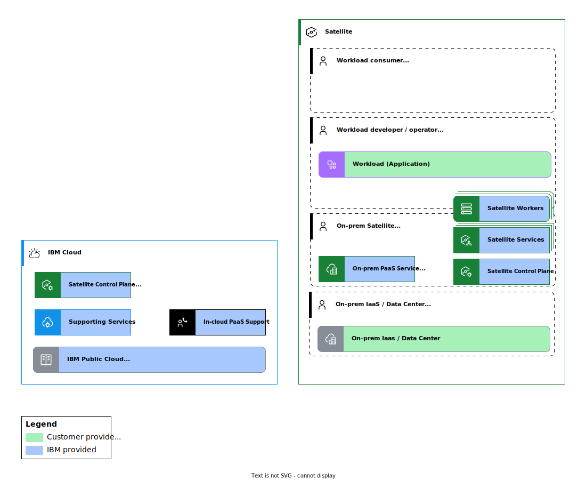

---

copyright:
  years: 2020, 2022
lastupdated: "2022-07-28"

keywords: 

subcollection: framework-financial-services

---

{{site.data.keyword.attribute-definition-list}}

# {{site.data.keyword.satelliteshort}} reference architecture shared responsibility model
{: #satellite-architecture-shared-responsibilities}

In {{site.data.keyword.cloud_notm}}, the responsibilities for deploying, operating, and securing products are shared between {{site.data.keyword.IBM_notm}} and our customers. This [{{site.data.keyword.cloud}} shared responsibility model](/docs/overview?topic=overview-shared-responsibilities#managed-responsibilities) is one of the most important things to understand when interpreting the control requirements of the {{site.data.keyword.framework-fs_notm}}. Here we dive deeper into this shared responsibility model for the [{{site.data.keyword.satelliteshort}} reference architecture](/docs/framework-financial-services?topic=framework-financial-services-satellite-architecture-about).
{: shortdesc}

## Shared responsibilities for {{site.data.keyword.cloud_notm}} products
{: #satellite-architecture-shared-responsibilities-roles}

All services that run in {{site.data.keyword.cloud_notm}} as part of the {{site.data.keyword.satelliteshort}} reference architecture are considered [managed products](/docs/overview?topic=overview-shared-responsibilities#managed-responsibilities) in the {{site.data.keyword.cloud_notm}} shared responsibility model. Each of these products has their own [service-specific shared responsibilities](/docs/framework-financial-services?topic=framework-financial-services-shared-responsibilities). 

Due to the hybrid nature of {{site.data.keyword.satelliteshort}}, there is a unique set of [{{site.data.keyword.satelliteshort}}-specific shared responsibilities](/docs/satellite?topic=satellite-responsibilities) for components that run in the on-premises {{site.data.keyword.satelliteshort}} location.

For all products, these responsibilities cut across the following five task areas, which intersect with the {{site.data.keyword.framework-fs_notm}}'s [best practices and requirements](/docs/framework-financial-services?topic=framework-financial-services-best-practices):

| Types of tasks | Description |
| - | - |
| [Incident and operations management](/docs/satellite?topic=satellite-responsibilities#incident-and-ops) | Includes tasks such as monitoring, event management, high availability, problem determination, recovery, and full state backup and recovery.  |
| [Change management](/docs/satellite?topic=satellite-responsibilities#change-management) | Includes tasks such as deployment, configuration, upgrades, patching, configuration changes, and deletion. |
| [Identity and access management](/docs/satellite?topic=satellite-responsibilities#iam-responsibilities) | Includes tasks such as authentication, authorization, access control policies, and approving, granting, and revoking access. |
| [Security and regulation compliance](/docs/satellite?topic=satellite-responsibilities#security-compliance) | Includes tasks such as security controls implementation and compliance certification. |
| [Disaster Recovery](/docs/satellite?topic=satellite-responsibilities#disaster-recovery) | Includes tasks such as providing dependencies on disaster recovery sites, provision disaster recovery environments, data and configuration backup, replicating data and configuration to the disaster recovery environment, and failover on disaster events. |
{: summary="The rows are read from left to right. The first column is the title for the set of tasks. The next column describe the tasks."}
{: caption="Table 1. Tasks areas in {{site.data.keyword.cloud_notm}} shared responsibility model" caption-side="top"}

## Additional roles for shared responsibility matrix
{: #satellite-architecture-shared-responsibilities-roles}

The two-party view of responsibility doesn't adequately account for the broader set of roles (often represented by teams or even different companies) that need to collaborate to ensure that the overall solution provides a secure platform for workloads and data. In the following diagram and table, a broader set of roles is defined.

{: caption="Figure 1. Roles for {{site.data.keyword.satelliteshort}} reference architecture RACI matrix" caption-side="bottom"}

| Role | Description |
| - | - |
| Workload consumer | Line-of-business organization that uses the workload or represents the internal or external users of the workload.  |
| Workload provider | Client IT development and operations team responsible for developing, deploying, and managing the workload and user responsibility for the PaaS layer (for example, by providing updated operating system images or requesting worker node upgrades). |
| {{site.data.keyword.cloud_notm}} on-premises PaaS provider | {{site.data.keyword.cloud_notm}} development and operations teams responsible for the Satellite components deployed on-premises. Many supporting services, processes, and operations run in {{site.data.keyword.cloud_notm}}. |
| On-premises IaaS / data center provider | Client IT operations and facilities teams responsible for the data center, networking, hardware, and virtualization that supports the on-premises PaaS and workload. |
| {{site.data.keyword.cloud_notm}} IaaS / data center provider | {{site.data.keyword.cloud_notm}} development and operations teams responsible for the direct {{site.data.keyword.satelliteshort}} management capabilities and supporting services that run in {{site.data.keyword.cloud_notm}}. |
{: summary="The rows are read from left to right. The first column is the title for the role. The next columns describe the role."}
{: caption="Table 2. Roles for deploying, managing, and operating all components of the Satellite reference architecture" caption-side="top"}

## Overview of shared responsibilities
{: #overview-by-resource}

Review the following table of who is responsible for particular cloud resources when using {{site.data.keyword.satelliteshort}}. In the table, "Shared" means that there is a shared responsibility between the workload provider and the {{site.data.keyword.cloud_notm}} on-premises PaaS provider.

| Resource | [Incident and operations management](/docs/satellite?topic=satellite-responsibilities#incident-and-ops) | [Change management](/docs/satellite?topic=satellite-responsibilities#change-management) | [Identity and access management](/docs/satellite?topic=satellite-responsibilities#iam-responsibilities) | [Security and regulation compliance](/docs/satellite?topic=satellite-responsibilities#security-compliance) | [Disaster Recovery](/docs/satellite?topic=satellite-responsibilities#disaster-recovery) |
| - | - | - | - | - | - |
| Client data | Workload provider | Workload provider | Workload provider | Workload provider | Workload provider |
| Application | Workload provider | Workload provider | Workload provider | Workload provider | Workload provider |
| {{site.data.keyword.satelliteshort}} Location | [Shared](/docs/satellite?topic=satellite-responsibilities#incident-and-ops) | [Shared](/docs/satellite?topic=satellite-responsibilities#change-management) | [Shared](/docs/satellite?topic=satellite-responsibilities#iam-responsibilities) | [Shared](/docs/satellite?topic=satellite-responsibilities#security-compliance) | [Shared](/docs/satellite?topic=satellite-responsibilities#disaster-recovery) |
| {{site.data.keyword.satelliteshort}} Host | [Shared](/docs/satellite?topic=satellite-responsibilities#incident-and-ops) | [Shared](/docs/satellite?topic=satellite-responsibilities#change-management) | [Shared](/docs/satellite?topic=satellite-responsibilities#iam-responsibilities) | [Shared](/docs/satellite?topic=satellite-responsibilities#security-compliance) | [Shared](/docs/satellite?topic=satellite-responsibilities#disaster-recovery) |
| {{site.data.keyword.satelliteshort}} Config | [Shared](/docs/satellite?topic=satellite-responsibilities#incident-and-ops) | [Shared](/docs/satellite?topic=satellite-responsibilities#change-management) | [Shared](/docs/satellite?topic=satellite-responsibilities#iam-responsibilities) | [Shared](/docs/satellite?topic=satellite-responsibilities#security-compliance) | [Shared](/docs/satellite?topic=satellite-responsibilities#disaster-recovery) |
| {{site.data.keyword.satelliteshort}} Link | [Shared](/docs/satellite?topic=satellite-responsibilities#incident-and-ops) | [Shared](/docs/satellite?topic=satellite-responsibilities#change-management) | [Shared](/docs/satellite?topic=satellite-responsibilities#iam-responsibilities) | [Shared](/docs/satellite?topic=satellite-responsibilities#security-compliance) | [Workload provider](/docs/satellite?topic=satellite-responsibilities#disaster-recovery) | 
| {{site.data.keyword.satelliteshort}} Storage | [Shared](/docs/satellite?topic=satellite-responsibilities#incident-and-ops) | [Shared](/docs/satellite?topic=satellite-responsibilities#change-management) | [Workload provider](/docs/satellite?topic=satellite-responsibilities#iam-responsibilities) | [Shared](/docs/satellite?topic=satellite-responsibilities#security-compliance) | [Shared](/docs/satellite?topic=satellite-responsibilities#disaster-recovery) |
| {{site.data.keyword.satelliteshort}}-enabled services | [Shared](/docs/satellite?topic=satellite-responsibilities#incident-and-ops) | [Shared](/docs/satellite?topic=satellite-responsibilities#change-management) | [Shared](/docs/satellite?topic=satellite-responsibilities#iam-responsibilities) | [Shared](/docs/satellite?topic=satellite-responsibilities#security-compliance) | [Shared](/docs/satellite?topic=satellite-responsibilities#disaster-recovery) |
| Operating System | Workload provider | [Shared](/docs/satellite?topic=satellite-responsibilities#change-management) | Workload provider | [Shared](/docs/satellite?topic=satellite-responsibilities#security-compliance) | Workload provider |
| Virtual and bare metal servers | On-prem IaaS / data center provider | On-prem IaaS / data center provider | On-prem IaaS / data center provider | On-prem IaaS / data center provider | On-prem IaaS / data center provider |
| Virtual storage | On-prem IaaS / data center provider | On-prem IaaS / data center provider | On-prem IaaS / data center provider | On-prem IaaS / data center provider | On-prem IaaS / data center provider |
| Virtual network | On-prem IaaS / data center provider | On-prem IaaS / data center provider | On-prem IaaS / data center provider | On-prem IaaS / data center provider | On-prem IaaS / data center provider |
| Hypervisor | On-prem IaaS / data center provider | On-prem IaaS / data center provider | On-prem IaaS / data center provider | On-prem IaaS / data center provider | On-prem IaaS / data center provider |
| Physical servers and memory | On-prem IaaS / data center provider | On-prem IaaS / data center provider | On-prem IaaS / data center provider | On-prem IaaS / data center provider | On-prem IaaS / data center provider |
| Physical storage | On-prem IaaS / data center provider | On-prem IaaS / data center provider | On-prem IaaS / data center provider | On-prem IaaS / data center provider | On-prem IaaS / data center provider |
| Physical network and devices | On-prem IaaS / data center provider | On-prem IaaS / data center provider | On-prem IaaS / data center provider | On-prem IaaS / data center provider | On-prem IaaS / data center provider |
| Facilities and data centers | On-prem IaaS / data center provider | On-prem IaaS / data center provider | On-prem IaaS / data center provider | On-prem IaaS / data center provider | On-prem IaaS / data center provider |
{: summary="The rows are read from left to right. The resource area of comparing responsibilities is in the first column. The next five columns describe whether you, {{site.data.keyword.IBM_notm}} , or both have shared responsibilities for a particular area."}
{: caption="Table 3. Overview of shared responsibilities." caption-side="top"}

## {{site.data.keyword.satelliteshort}} location control plane and workload clusters
{: #satellite-location-control-plane-workload-clusters}

The following table goes a level deeper and shows the shared responsibilities for the control plane worker nodes and your workload clusters in the {{site.data.keyword.satelliteshort}} location. In the table, "Shared" means that there is a shared responsibility between the workload provider and the {{site.data.keyword.cloud_notm}} on-premises PaaS provider.

| Resource | Control plane worker nodes | Workload clusters |
| - | - | - |
| Client data | n/a | Workload provider |
| Application | Shared | Workload provider |
| {{site.data.keyword.satelliteshort}} Host | Shared | Shared |
| {{site.data.keyword.satelliteshort}} Config | Shared | n/a |
| {{site.data.keyword.satelliteshort}} Link | Shared [^tabletext-1] | n/a |
| {{site.data.keyword.satelliteshort}} Storage | Shared [^tabletext-2] | Shared [^tabletext-3] |
| Host networking | On-premises PaaS provider | Workload provider |
| Operating System | Shared [^tabletext-4] | Shared [^tabletext-5] |
| Virtual and bare metal servers | On-premises IaaS / data center provider | On-premises IaaS / data center provider |
| Virtual storage | On-premises IaaS / data center provider | On-premises IaaS / data center provider |
| Virtual network | On-premises IaaS / data center provider | On-premises IaaS / data center provider |
| Hypervisor | On-premises IaaS / data center provider | On-premises IaaS / data center provider |
| Physical servers and memory | On-premises IaaS / data center provider | On-premises IaaS / data center provider |
| Physical storage | On-premises IaaS / data center provider | On-premises IaaS / data center provider |
| Physical network and devices | On-premises IaaS / data center provider | On-premises IaaS / data center provider |
| Facilities and data centers | On-premises IaaS / data center provider | On-premises IaaS / data center provider |
{: summary="The rows are read from left to right. The resource area for comparing responsibilities in the {{site.data.keyword.satelliteshort}} location is in the first column. The next two columns describe whether you, {{site.data.keyword.IBM_notm}}, or both have shared responsibilities for a particular area."}
{: caption="Table 4. Overview of shared responsibilities in {{site.data.keyword.satelliteshort}} location." caption-side="top"}

[^tabletext-1]: {{site.data.content.workload-provider-responsibilities-link}}

[^tabletext-2]: {{site.data.content.workload-provider-responsibilities-storage}}

[^tabletext-3]: {{site.data.content.workload-provider-responsibilities-storage}}

[^tabletext-4]: {{site.data.content.workload-provider-responsibilities-operating-system}}

[^tabletext-5]: {{site.data.content.workload-provider-responsibilities-operating-system}}

## Other on-premises components outside of the {{site.data.keyword.satellitelong_notm}} location
{: #other-components}

The workload provider and on-premises IaaS / data center provider are solely responsible for edge plane, management plane, and other applications that you run in the on-premises environment outside of the {{site.data.keyword.satelliteshort}} location.

## Next steps
{: #next-steps}

- [{{site.data.keyword.satelliteshort}} architecture best practices](/docs/framework-financial-services?topic=framework-financial-services-satellite-architecture-best-practices)
