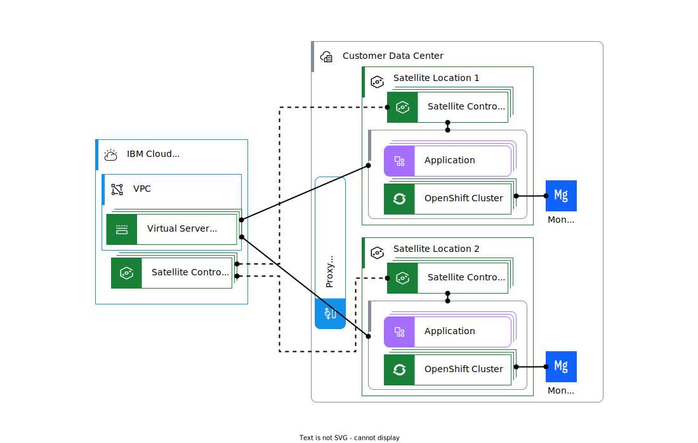
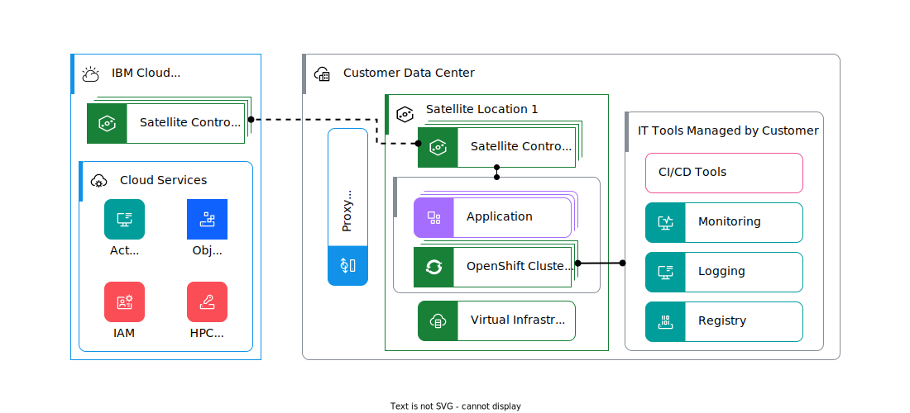

---

copyright:
  years: 2020, 2024
lastupdated: "2024-10-09"

keywords: 

subcollection: framework-financial-services

---

{{site.data.keyword.attribute-definition-list}}

# {{site.data.keyword.satelliteshort}} reference architecture use cases
{: #satellite-architecture-use-cases}

Use cases for the [{{site.data.keyword.satelliteshort}} reference architecture](/docs/framework-financial-services?topic=framework-financial-services-satellite-architecture-about)  for the {{site.data.keyword.cloud_notm}} for Financial Services typically fall into the four categories in the following table.
{: shortdec}

| Use Case | Description |
| - | - |
| Platform modernization | Innovate faster and free your team to develop applications with {{site.data.keyword.openshiftshort}} on-premises. Establish container portability and PaaS foundation for developer services and digital supply chain operations. Achieve improved cybersecurity with industry-leading Keep Your Own Key encryption. |
| Concentration risk | Mitigate regulatory concerns about concentration risk by using a hybrid cloud deployment model that uses {{site.data.keyword.satelliteshort}} to extend secure Financial Services Validated offerings from {{site.data.keyword.cloud_notm}} to your data center. |
| Data residency| Manage local data requirements &mdash; storage (residency) and legal protections (sovereignty) &mdash; by keeping data in-country and accessing public cloud services. Improve data privacy (cybersecurity) for regulated data with industry-leading Keep Your Own Key encryption. |
| AI and automation | Gain new insights and process automation by enhancing databases on-premises with {{site.data.keyword.cloud_notm}} Pak AI and automation services that are deployed with {{site.data.keyword.openshiftshort}}. Maintain control of data on-premises for performance, sovereignty, and regulatory requirements. |
{: summary="The rows are read from left to right. The use case title is in the first column. The second columns describes the use case referenced in the first column."}
{: caption="Overview of use cases for the {{site.data.keyword.satelliteshort}} reference architecture" caption-side="top"}

Two uses cases from real financial institutions are presented in the following sections.

## US regional bank 
{: #satellite-architecture-use-cases-1}

During a time-sensitive merger, a US regional bank needed to integrate two entities’ IT operations securely and bring consistency across container platforms in on-premises branch locations without adding overhead. {{site.data.keyword.satelliteshort}} enabled the customer to establish a location that used its existing data center infrastructure and create multiple {{site.data.keyword.openshiftshort}} clusters so that teams could build and host containerized workloads in a consistent way and pay only for what they consumed. This scenario is an example of using {{site.data.keyword.satelliteshort}} for platform modernization.

The following diagram shows a high-level overview of the architecture that is used by this financial institution.

{: caption="High-level modification of {{site.data.keyword.satelliteshort}} reference architecture for the first institution" caption-side="bottom"}

Key features of their approach include:
 
- Using VMWare or other virtualization infrastructure to provide the hosts in the {{site.data.keyword.satelliteshort}} location.
- Leveraging a proxy that they manage for traffic to and from the {{site.data.keyword.satelliteshort}} location.
- Running {{site.data.keyword.satelliteshort}}-enabled {{site.data.keyword.openshiftshort}} for their workloads and exploring other {{site.data.keyword.satelliteshort}}-enabled services in later phases when they become Financial Services Validated.
- Hosting on-premises databases on virtual machines outside the {{site.data.keyword.satelliteshort}} location within the enterprise.
- Placing management tools in virtual servers within their {{site.data.keyword.cloud_notm}} account.
- Using the following services on {{site.data.keyword.cloud_notm}}:
    - IAM for identity and access management
    - {{site.data.keyword.atracker_short}} to collect {{site.data.keyword.cloud_notm}} audit events
    - {{site.data.keyword.cos_short}} for backup and archiving data

## Multinational bank
{: #satellite-architecture-use-cases-2}

A multinational bank wanted to ensure they were following local requirements for data residency by keeping data in country when they were accessing public cloud services. The {{site.data.keyword.satelliteshort}} reference architecture was a perfect fit for them.

The following diagram shows a high-level overview of the architecture that is used by this second institution.

{: caption="High-level modification of {{site.data.keyword.satelliteshort}} reference architecture for the second institution" caption-side="bottom"}

Highlights of their architecture include the following:

- Using on-premises virtual infrastructure for the {{site.data.keyword.satelliteshort}} location
- Using a proxy that they manage for traffic to and from the {{site.data.keyword.satelliteshort}} location
- Running {{site.data.keyword.satelliteshort}}-enabled {{site.data.keyword.openshiftshort}} for their workloads
- Integrating with various on-premises solutions (outside of the {{site.data.keyword.satelliteshort}} location) for logging, monitoring, image registry, and DevOps
- Using the following services on {{site.data.keyword.cloud_notm}}:
    - IAM for identity and access management, federated with an external identity provider (Active Directory Federation Services)
    - {{site.data.keyword.cos_short}} for {{site.data.keyword.openshiftshort}} control plane backups
    - {{site.data.keyword.redhat_notm}} NTP to sync the time on all nodes

## Next steps
{: #next-steps}

- [{{site.data.keyword.satelliteshort}} shared responsibility model](/docs/framework-financial-services?topic=framework-financial-services-satellite-architecture-shared-responsibilities)
- [{{site.data.keyword.satelliteshort}} architecture best practices](/docs/framework-financial-services?topic=framework-financial-services-satellite-architecture-best-practices)
