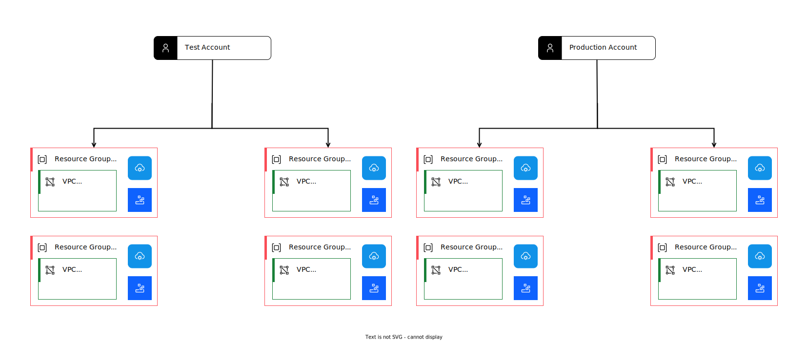

---

copyright:
  years: 2020, 2022
lastupdated: "2022-07-28"

keywords: 

subcollection: framework-financial-services

---

{{site.data.keyword.attribute-definition-list}}

# Organizing {{site.data.keyword.cloud_notm}} accounts and resources
{: #shared-account-organization}

After you complete your [{{site.data.keyword.cloud_notm}} account setup](/docs/allowlist/framework-financial-services?topic=framework-financial-services-shared-account-setup), consider the best practices for organizing your accounts and resources. The choices here are important as you set up [access management](/docs/allowlist/framework-financial-services?topic=framework-financial-services-shared-account-access-management) in later steps.
{: shortdesc}

All resources that are managed by [{{site.data.keyword.cloud_notm}} Identity and Access Management (IAM)](/docs/account?topic=account-access-getstarted) are placed into resource groups for access control and billing purposes.

For more information, see:

* [Best practices for organizing resources and assigning access](/docs/account?topic=account-account_setup)
* [Managing resource groups](/docs/account?topic=account-rgs)

## Organization for a single deployment
{: #single-deployment}

### VPC reference architecture
{: #single-deployment-vpc}

For the VPC reference architecture, it is recommended that you use two resource groups for each deployment:

* Management - Holds all of the resources that are needed by your management VPC
* Workload - Holds all of the resources that are needed by your workload VPC

This creates a clean separation between the layers. The following diagram shows such a layout.

{: caption="Figure X. Account with two resource groups for management and workload VPCs" caption-side="bottom"}

### {{site.data.keyword.satelliteshort}} reference architecture
{: #single-deployment-satellite}

For the {{site.data.keyword.satelliteshort}} reference architecture, you can put all of your {{site.data.keyword.cloud_notm}} resources that are related to a single {{site.data.keyword.satelliteshort}} deployment into one resource group.

{: caption="Figure X. Account with one resource group for {{site.data.keyword.satelliteshort}}-related resources" caption-side="bottom"}

## Organization for multiple deployments
{: #multiple-deployments}

It is required that you have [separate test and production deployments](/docs/allowlist/framework-financial-services?topic=framework-financial-services-best-practices#best-practices-non-production-environments) of the reference architecture, and that those deployments are managed by separate accounts. This means you need at least two accounts, each with a dedicated resource group.

### VPC reference architecture
{: #multiple-deployments-vpc}

The following diagram shows a depiction of this organization for the VPC reference architecture.

{: caption="Figure X. Multiple accounts for VPC reference architecture with two resource groups" caption-side="bottom"}

### {{site.data.keyword.satelliteshort}} reference architecture
{: #multiple-deployments-satellite}

The following diagram shows a depiction of this organization for the {{site.data.keyword.satelliteshort}} reference architecture.

{: caption="Figure X. Multiple accounts for Satellite reference architecture" caption-side="bottom"}

## Scaling the number of deployments
{: #scaling-deployments}

Each deployment is single tenant, meaning the deployment is intended to be used by a single consumer. We recommend creating a new account for each deployment. If you have multiple consumers, then you need multiple accounts. Multiple individual accounts might quickly become unwieldy, so we recommend that you use an [enterprise account](#enterprises).

But, if for some reason you do not want to use an enterprise and you have a limited number of consumers, then you might also consider a variation where you maintain separate resource groups for each deployment within an account.

### VPC reference architecture
{: #scaling-deployments-satellite}

For the VPC reference architecture, this variation is shown in the following diagram. In this case, we still have a test and production account, but we create two new resource groups for each deployment.

{: caption="Figure X. Using two accounts with multiple resource groups for VPC reference architecture" caption-side="bottom"}

While this reduces the number of accounts you need, it can also become problematic because each account is subject to [quotas and service limits](/docs/vpc?topic=vpc-quotas) for VPC.

### {{site.data.keyword.satelliteshort}} reference architecture
{: #scaling-deployments-satellite}

For the {{site.data.keyword.satelliteshort}} reference architecture, we still have a test and production account. We then create one new resource group for each deployment as shown in the following diagram.

{: caption="Figure X. Using two accounts with multiple resource groups for {{site.data.keyword.satelliteshort}} reference architecture" caption-side="bottom"}

## Managing scalability with an enterprise
{: #enterprises}

### Rationale for using an enterprise
{: #enterprises-rationale}

Unless you have a limited number of deployments and accounts, it is highly recommended that you use an [enterprise](/docs/account?topic=account-what-is-enterprise).

To set up an enterprise, it is required that you have a Subscription account. See [Upgrading your account](/docs/account?topic=account-upgrading-account) for more details.
{: tip}

{{site.data.keyword.cloud_notm}} enterprises provide a way for you to centrally manage billing and track resource usage across multiple accounts. Within an enterprise, you create a multitiered hierarchy of accounts, with billing and payments for all accounts managed at the enterprise level.

When compared to using multiple stand-alone accounts, enterprises offer the following key benefits:

* Centralized account management: View your entire enterprise hierarchy at a glance, without needing to switch accounts. You can add existing accounts or create new accounts directly within the enterprise.
* Consolidated subscription billing: Track your subscriptions and credit spending for all accounts from a single view. Your subscription credit is pooled and shared among accounts in the enterprise.
* Top-down usage reporting: From your enterprise account, you can view usage of all accounts in your enterprise, which is organized by account group.

To learn more about enterprises, also see:

* [Setting up an enterprise](/docs/account?topic=account-enterprise-tutorial)
* [Best practices for setting up an enterprise](/docs/account?topic=account-enterprise-best-practices)

### Organizing your enterprise
{: #enterprises-organization}

Within an enterprise, you can create multiple accounts and account groups. With this structure, you can easily manage many accounts and many deployments.

#### VPC reference architecture
{: #enterprises-organization-satellite}

The following diagram shows an enterprise with one account group that contains separate accounts for each deployment of the VPC reference architecture.

{: caption="Figure X. Enterprise account organization with VPC reference architecture" caption-side="bottom"}

#### {{site.data.keyword.satelliteshort}} reference architecture
{: #enterprises-organization-satellite}

The following diagram shows an enterprise with one account group that contains separate accounts for each deployment of the {{site.data.keyword.satelliteshort}} reference architecture.

{: caption="Figure 4. Enterprise account organization" caption-side="bottom"}

## Related controls in {{site.data.keyword.framework-fs_notm}} 
{: #related-controls}

{{site.data.content.related-controls-disclaimer}}

| Family              | Control                                           |
|---------------------|---------------------------------------------------|
| Access Control (AC) | AC-5 Separation of Duties \n AC-6 Least Privilege |
{: caption="Table 1. Related controls in {{site.data.keyword.framework-fs_notm}}" caption-side="top"}

## Next steps
{: #next-steps}

* [Access management in {{site.data.keyword.cloud_notm}}](/docs/allowlist/framework-financial-services?topic=framework-financial-services-shared-account-access-management)
