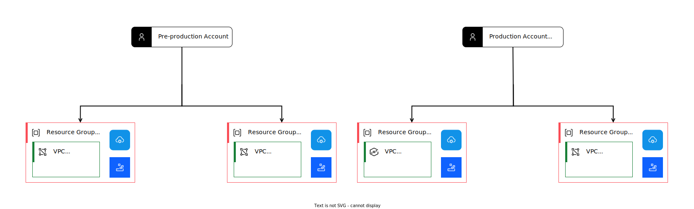

---

copyright:
  years: 2020, 2025
lastupdated: "2025-02-20"

keywords:

subcollection: framework-financial-services

---

{{site.data.keyword.attribute-definition-list}}

# Organizing {{site.data.keyword.cloud_notm}} accounts and resources
{: #shared-account-organization}

After you complete your [{{site.data.keyword.cloud_notm}} account setup](/docs/framework-financial-services?topic=framework-financial-services-shared-account-setup), consider the best practices for organizing your accounts and resources. The choices you make have a significant impact as you set up [access management](/docs/framework-financial-services?topic=framework-financial-services-shared-account-access-management) in later steps, as well as how well your organization can scale over time.
{: shortdesc}

Each deployment of one of the reference architectures is single tenant, meaning the deployment is intended to be used by a single consumer. We recommend creating a new account for each deployment. If you have multiple consumers, then you need multiple accounts. Multiple individual accounts might quickly become unwieldy, so we recommend that you use an [enterprise account](#enterprises).

Within an account, all resources managed by [{{site.data.keyword.cloud_notm}} Identity and Access Management (IAM)](/docs/account?topic=account-access-getstarted) are placed into resource groups for access control and billing purposes.

For more information, see:

* [Best practices for organizing resources and assigning access](/docs/account?topic=account-account_setup)
* [Managing resource groups](/docs/account?topic=account-rgs)

## Organization for a single deployment within an account
{: #single-deployment}

### VPC reference architecture
{: #single-deployment-vpc}

For the VPC reference architecture, it is recommended that you use two resource groups for each deployment:

* Management - Holds all of the resources that are needed by your management VPC
* Workload - Holds all of the resources that are needed by your workload VPC

This creates a clean separation between the layers. The following diagram shows such a layout.

{: caption="Account with two resource groups for management and workload VPCs" caption-side="bottom"}

While not shown in the diagram, it is also permissable to take isolation a step further and place your management VPC in one account and your workload VPC in another account.
{: note}

### {{site.data.keyword.satelliteshort}} reference architecture
{: #single-deployment-satellite}

For the {{site.data.keyword.satelliteshort}} reference architecture, you can put all of your {{site.data.keyword.cloud_notm}} resources that are related to a single {{site.data.keyword.satelliteshort}} deployment into one resource group.

{: caption="Account with one resource group for {{site.data.keyword.satelliteshort}}-related resources" caption-side="bottom"}

## Organization for multiple deployments
{: #multiple-deployments}

It is required that you have [separate test and production deployments](/docs/framework-financial-services?topic=framework-financial-services-best-practices#best-practices-non-production-environments) of the reference architecture, and that those deployments are managed by separate accounts. This means you need at least two accounts, each with a dedicated resource group.

### VPC reference architecture
{: #multiple-deployments-vpc}

The following diagram shows a depiction of this organization for the VPC reference architecture.

{: caption="Multiple accounts for VPC reference architecture with two resource groups" caption-side="bottom"}

### {{site.data.keyword.satelliteshort}} reference architecture
{: #multiple-deployments-satellite}

The following diagram shows a depiction of this organization for the {{site.data.keyword.satelliteshort}} reference architecture.

{: caption="Multiple accounts for Satellite reference architecture" caption-side="bottom"}

## Scaling the number of deployments within an account
{: #scaling-deployments}

If for some reason you do not want to use an [enterprise account](#enterprises) and you have a limited number of consumers, then you might also consider a variation where you maintain separate resource groups for each deployment within an account.

### VPC reference architecture
{: #scaling-deployments-satellite}

For the VPC reference architecture, this variation is shown in the following diagram. In this case, we still have a test and production account, but we create two new resource groups for each deployment.

{: caption="Using two accounts with multiple resource groups for VPC reference architecture" caption-side="bottom"}

While this reduces the number of accounts you need, it can also become problematic because each account is subject to [quotas and service limits](/docs/vpc?topic=vpc-quotas) for VPC.

### {{site.data.keyword.satelliteshort}} reference architecture
{: #scaling-deployments-satellite}

For the {{site.data.keyword.satelliteshort}} reference architecture, we still have a test and production account. We then create one new resource group for each deployment as shown in the following diagram.

{: caption="Using two accounts with multiple resource groups for {{site.data.keyword.satelliteshort}} reference architecture" caption-side="bottom"}

## Managing scalability with an enterprise
{: #enterprises}

### Rationale for using an enterprise
{: #enterprises-rationale}

Unless you have a limited number of deployments and accounts, it is highly recommended that you use an [enterprise](/docs/enterprise-management?topic=enterprise-management-what-is-enterprise). Large enterprises that allow an account structure, cross account networking, resource deployment, and billing to develop organically run the risk of encountering governance, scaling, security, and accounting issues. See [Enterprise account architecture](/docs/enterprise-account-architecture?topic=enterprise-account-architecture-about) for recommendations on how to address these concerns across accounts so that a robust, compliant, and scalable solution can be achieved.

### Organizing your enterprise
{: #enterprises-organization}

Within an enterprise, you can create multiple accounts and account groups. With this structure, you can easily manage many accounts and many deployments.

#### VPC reference architecture
{: #enterprises-organization-satellite}

The following diagram shows a single enterprise with one account group that contains separate accounts for each deployment of the VPC reference architecture.

{: caption="Enterprise account organization with VPC reference architecture" caption-side="bottom"}

When using enterprise accounts, it is recommended that you use one enterprise account for production and another enterprise account for development. See [Planning your enterprise account structure](/docs/enterprise-account-architecture?topic=enterprise-account-architecture-account-structure) for more information.

#### {{site.data.keyword.satelliteshort}} reference architecture
{: #enterprises-organization-satellite}

The following diagram shows an enterprise with one account group that contains separate accounts for each deployment of the {{site.data.keyword.satelliteshort}} reference architecture.

{: caption="Enterprise account organization" caption-side="bottom"}

## Related controls in {{site.data.keyword.framework-fs_notm}}
{: #related-controls}

{{site.data.content.related-controls-disclaimer}}

| Family              | Control                                           |
|---------------------|---------------------------------------------------|
| Access Control (AC) | [AC-5 Separation of Duties](/docs/framework-financial-services-controls?topic=framework-financial-services-controls-ac-5) \n [AC-6 Least Privilege](/docs/framework-financial-services-controls?topic=framework-financial-services-controls-ac-6) |
{: caption="Related controls in {{site.data.keyword.framework-fs_notm}} [FSv2.0]" caption-side="top"}
{: #related-controls-fsv2.0}
{: tab-title="FSv2.0"}
{: tab-group="RelatedControls-1"}
{: class="simple-tab-table"}

| Family              | Control                                           |
|---------------------|---------------------------------------------------|
| Access Control (AC) | [AC-5 Separation of Duties](/docs/framework-financial-services-controls-fsv1-1?topic=framework-financial-services-controls-fsv1-1-ac-5) \n [AC-6 Least Privilege](/docs/framework-financial-services-controls-fsv1-1?topic=framework-financial-services-controls-fsv1-1-ac-6) |
{: caption="Related controls in {{site.data.keyword.framework-fs_notm}} [FSv1.1]" caption-side="top"}
{: #related-controls-fsv1.1}
{: tab-title="FSv1.1"}
{: tab-group="RelatedControls-1"}
{: class="simple-tab-table"}

## Next steps
{: #next-steps}

* [Access management in {{site.data.keyword.cloud_notm}}](/docs/framework-financial-services?topic=framework-financial-services-shared-account-access-management)
