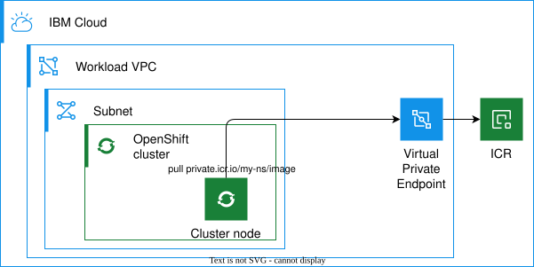
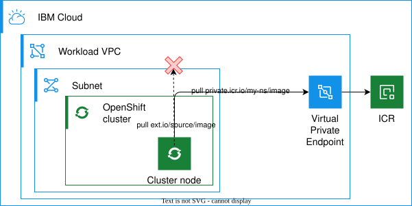

---
copyright:
  years: 2026
lastupdated: "2026-06-09"

keywords: container images, image management, roks, openshift, financial services, image registry, icr

subcollection: framework-financial-services

---

{{site.data.keyword.attribute-definition-list}}

# Image management in {{site.data.keyword.openshiftshort}} clusters
{: #ocp-image-mgmt-overview}

This pattern presents a set of architectural alternatives for controlling access to container images used in workload deployments on {{site.data.keyword.openshiftshort}} clusters. The result is an approach that enables secure workload deployment with required controls over software supply chain elements.
{: shortdesc}

IBM Cloud for Financial Services provides several controls applicable to container image management for workload deployment on IBM Cloud container platform services such as {{site.data.keyword.openshiftshort}} :

* [SI-7](/docs/framework-financial-services-controls?topic=framework-financial-services-controls-si-7){: external} - Software, Firmware, and Information Integrity
* [CM-6](/docs/framework-financial-services-controls?topic=framework-financial-services-controls-cm-6){: external} - Configuration Settings
* [SI-4 (4)](/docs/framework-financial-services-controls?topic=framework-financial-services-controls-si-4.4){: external} - Inbound and Outbound Communications Traffic
* [SC-7](/docs/framework-financial-services-controls?topic=framework-financial-services-controls-sc-7){: external} - Boundary Protection
* [SC-7 (5)](/docs/framework-financial-services-controls?topic=framework-financial-services-controls-sc-7.5){: external} - Deny by Default — Allow by Exception

A typical workload deployment on an {{site.data.keyword.openshiftshort}} cluster usually requires a number of container images often pulled from public registries. A secure and compliant solution requires implementing control over both the inventory of the allowed software components and the network access to its distribution point such as a container registry.

## Scope
{: #scope}

This pattern addresses the following aspects of container image management:

### Repository access
{: #repository-access}

* Use only authorized managed repositories (such as IBM Container Registry on IBM Cloud) for container images. The image registry service or instance should comply with the requirements for account and identity management, hosting infrastructure security, observability, and resilience.
* Restrict network access to external public registries while enabling deployment of required images using registry mirroring.
* Prevent workload deployment process from pulling images from an arbitrary external registry or not in the approved list to the container platform directly.

### Image acceptance policies
{: #image-acceptance-policies}

* Only specific images from an approved list should be allowed to be deployed on a container platform.
* All applicable software components must be cryptographically signed by the manufacturer or developer to ensure you can perform integrity checks and verify that the component that is deployed in the system is the same component that the manufacturer or developer evaluated and certified.
* Controlled deployment of Operators from public marketplaces using registry mirroring.

### Vulnerability scanning
{: #vulnerability-scanning}

* Container images stored in a managed registry should be periodically scanned for vulnerabilities.
* The images deployed on a container platform or in the approved list should be periodically scanned for vulnerabilities.

### Out of scope
{: #out-of-scope}

The following topics are not covered in this pattern:

* Container platforms other than {{site.data.keyword.openshiftshort}} 
* Secure development process for building custom images and deploying cluster resources (CI/CD)
* A procedure to review, validate, and approve container images required for the workload, including common public images
* A procedure to respond to new vulnerabilities discovered in workload images

## Approaches and recommendations
{: #approaches}

Depending on your requirements for external or third-party container images, you can implement various scenarios for image management.

In any of the scenarios, it is recommended to have the required container images stored in a private namespace in {{site.data.keyword.registryshort}} for full control of the image inventory and network access to the registry.

This pattern outlines the following approaches:

### Explicit references to images in {{site.data.keyword.registryshort}} private namespaces
{: #explicit-references}

If you can configure your deployment manifests to reference container images in your private {{site.data.keyword.registryshort}}, you can avoid a need to access external or public or third-party registries. This option is most suitable for small custom workloads where you can modify the image references in your deployment manifests to point to a private {{site.data.keyword.registryshort}} namespace.

{: caption="Explicit references to images in {{site.data.keyword.registryshort}} private namespaces" caption-side="bottom"}

### Image mirroring to {{site.data.keyword.registryshort}} for transparent image reference resolution
{: #image-mirroring}

The registry mirroring can be set up on cluster nodes to use alternative locations for certain registries and images. Instead of pulling an image from an external registry, a cluster node will use a reference pointing to a private {{site.data.keyword.registryshort}} namespace. Image mirroring can be used in case of more complex workload deployments where it is not practical to modify the image references in the original deployment manifests, for example, when the workloads are deployed by existing Helm charts.

{: caption="Image mirroring to {{site.data.keyword.registryshort}}" caption-side="bottom"}

### Operator index and bundle image mirroring to {{site.data.keyword.registryshort}} for operator deployments
{: #operator-mirroring}

When deploying software components on an {{site.data.keyword.openshiftshort}} cluster via operators, various images are retrieved from one or more external image registries. Since you cannot control the image references in the original operator bundle images, image mirroring must be used along with mirroring operator catalog index images and operator bundle images to avoid opening network path to the external registries.

In a secure deployment of {{site.data.keyword.openshiftshort}} cluster, the cluster nodes do not have direct access to the external container registries. When a cluster node tries to pull an image referencing an external registry, the registry mirror configuration can redirect that request to a private {{site.data.keyword.registryshort}} namespace.

A process to mirror the required images to {{site.data.keyword.registryshort}} needs to be set up in an environment separate from the workload {{site.data.keyword.openshiftshort}} cluster – for example, a management VPC that has an HTTPS Proxy allowing a connection to the external registry or a compute resource on an enterprise network that can reach both the external registry and the {{site.data.keyword.registryshort}} private endpoint over a secure connection to IBM Cloud.

## Next steps
{: #next-steps}

* Review [planning guidance](/docs/framework-financial-services?topic=framework-financial-services-ocp-image-mgmt-planning-guidance) for {{site.data.keyword.openshiftshort}} administrators
* Understand [key considerations](/docs/framework-financial-services?topic=framework-financial-services-ocp-image-mgmt-planning-considerations) for evaluating image management options
* Follow the [implementation guides](/docs/framework-financial-services?topic=framework-financial-services-ocp-image-mgmt-icr-configuration) to set up image management for your cluster
