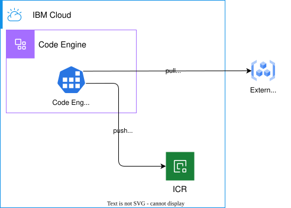
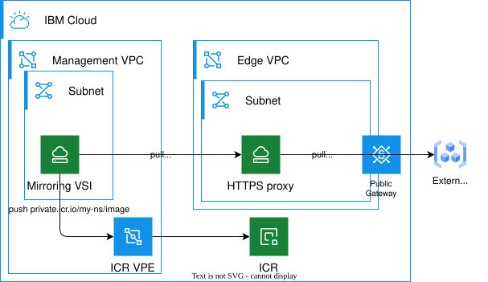
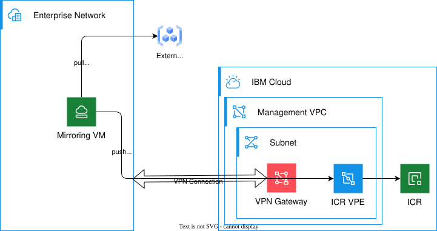

---
copyright:
  years: 2026
lastupdated: "2026-06-09"

keywords: planning, openshift, image management, registry, mirroring, operators

subcollection: framework-financial-services

---

{{site.data.keyword.attribute-definition-list}}

# Guidance for {{site.data.keyword.openshiftshort}} administrators
{: #ocp-image-mgmt-planning-guidance}

Review the following guidance to plan your container image management strategy for Red Hat {{site.data.keyword.openshiftshort}} clusters on IBM Cloud VPC.
{: shortdesc}

## Outbound traffic protection and external registries
{: #outbound-traffic}

The System and Communication Protection controls in IBM Cloud for Financial Services framework (for example, [SC-7 (5)](/docs/framework-financial-services-controls?topic=framework-financial-services-controls-sc-7.5){: external}) require that outbound connections from an {{site.data.keyword.openshiftshort}} cluster are explicitly permitted by destination. This creates a problem with accessing external image registries which often use a wide range of IP addresses that can change.

While HTTPS traffic can be routed through a transparent or forwarding proxy to enforce only allow-listed destinations, using this approach with an {{site.data.keyword.openshiftshort}} cluster in VPC still does not allow for fine-grain control over the image sets from external registries that are permitted (only the whole registry can be on the allow-list) and can lead to other issues.

Instead, it is recommended to store the container images in a private namespace in IBM Cloud Container Registry ({{site.data.keyword.registryshort}}) which can be accessed via a Virtual Private Endpoint (VPE) that provides an even greater control over network flows while also significantly reducing traffic volume to a public network.

## Container image integrity
{: #image-integrity}

Once all the required container images are stored in a private {{site.data.keyword.registryshort}} namespace, only the images from the private namespace that you control can be deployed on the {{site.data.keyword.openshiftshort}} cluster, since the network path to external registries is blocked. {{site.data.keyword.registryshort}} also provides the image scanning functionality, therefore you will have full visibility for the vulnerabilities that are discovered in the set of images being used in your workloads.

The {{site.data.keyword.openshiftshort}} cluster will still have access to baseline images on public namespaces in {{site.data.keyword.registryshort}} that are required for the default deployment of {{site.data.keyword.openshiftshort}} standard components. You can restrict the images being deployed in your own namespaces by using image acceptance policies.

## Operator deployment
{: #operator-deployment}

If your solution involves deploying operators from public or private catalogs, you will need to identify the required operators and their source registries. {{site.data.keyword.openshiftshort}} provides a command line tool (`oc-mirror`) that can automate mirroring of images used to deploy operators into a private {{site.data.keyword.registryshort}} namespace.

For each of the operators, you will need to go through the steps of mirroring the operator images into your {{site.data.keyword.registryshort}} private namespace, including catalog index and operator bundle images, as well as properly configuring Catalog Source resources for the mirrored operator index image. After that, the selected set of operators will become available for installation in OpenShift.

## Image mirroring
{: #image-mirroring-process}

The process that copies the images from the source registry to your private {{site.data.keyword.registryshort}} namespace (for example, using OpenShift's `oc-mirror` tool) needs to have network access to both the source external registry and the destination private endpoint in {{site.data.keyword.registryshort}}.

Depending on the location of the source registry, you may need to use a forwarding proxy that permits the HTTPS connections to the external registry endpoint from a compute environment on IBM Cloud. It is recommended to run the mirroring process outside of the {{site.data.keyword.openshiftshort}} cluster to decouple the network permissions for image mirroring from the outbound traffic restriction for the cluster itself.

The following options describe the mirroring process that uses {{site.data.keyword.registryshort}} private endpoints to ensure controlled access to {{site.data.keyword.registryshort}} private namespaces where a public endpoint access is blocked by Content Based Restrictions. Direct access to {{site.data.keyword.registryshort}} public endpoints from external environment should be considered a deviation from the Financial Services framework guidelines that requires a separate risk assessment and mitigation.

### Option 1: Code Engine job to run the mirroring process
{: #option-code-engine}

IBM Cloud Code Engine can host a job running `oc-mirror` tools when the job execution is requested.

{: caption="Mirroring to {{site.data.keyword.registryshort}} with Code Engine application" caption-side="bottom"}

**Advantages:**

* Minimal configuration in IBM Cloud
* Secure handling of necessary credentials via Code Engine secrets
* Lower operational and cloud resource cost

**Disadvantages:**

* Code Engine outbound traffic can be controlled via IP ranges, but access to certain public registries may require all outbound traffic from Code Engine project to be permitted
* An image for `oc-mirror` tool needs to be built

### Option 2: Mirroring process on a VSI in Management VPC
{: #option-vsi}

The `oc-mirror` CLI tool can be set up on a VSI within a Management VPC. An administrator will log in to the VSI shell and run the command manually when an update to the mirror is required.

{: caption="Mirroring to {{site.data.keyword.registryshort}} with a VSI in Management VPC" caption-side="bottom"}

**Advantages:**

* Quick to set up within an existing management environment
* Uses common HTTPS egress proxy deployment pattern for controlled access to outside resources

**Disadvantages:**

* Requires Management VPC and HTTPS proxy configuration
* Managing credentials for {{site.data.keyword.registryshort}} access may require more complex setup with VSI trusted profiles

### Option 3: Mirroring process running within an enterprise environment outside of IBM Cloud
{: #option-enterprise}

In case the source images are pulled from a private registry available only within an enterprise network, the `oc-mirror` process can be executed on a compute resource (a virtual machine or a containerized environment on-premises) within the private enterprise network.

Pushing the image to the {{site.data.keyword.registryshort}} is performed via a VPN tunnel or a similar secure connection between the enterprise network and IBM Cloud to use the {{site.data.keyword.registryshort}} private endpoint. This option can also be used when pulling images from a public external registry if the enterprise network can facilitate a controlled outbound connection to the registry.

{: caption="Mirroring to {{site.data.keyword.registryshort}} from an on-prem environment" caption-side="bottom"}

**Advantages:**

* Enables mirroring images from registries on private networks
* Minimal configuration in Management VPC

**Disadvantages:**

* Requires VPN connectivity to Management VPC
* Requires compute facilities within the enterprise network

## Image and operator update strategy
{: #update-strategy}

Since the images are copied from external registries by `oc-mirror` when the job is executed, the new images or changes in the source image tags (for example, which image is tagged as `latest`) are only appearing in the target {{site.data.keyword.registryshort}} after the next `oc-mirror` run.

The recommended approach is to explicitly list the tags or versions of operators and images in the `oc-mirror` configuration to avoid unexpected changes in the images and operators being deployed.

### Operator updates
{: #operator-updates}

When a new version of an operator is made available on the source registry, it should be evaluated in a staging environment for potential adverse upgrade effects and then added to the `oc-mirror` configuration. After the `oc-mirror` run, the new version will become visible in the catalog view on the cluster.

### Image updates
{: #image-updates}

For individual images, the specific version tags should be included in `oc-mirror` configuration and used in deployments. Newly released versions should be evaluated and added to the mirroring list.

When referencing dynamic tags such as `latest`, `oc-mirror` will copy the image that currently has the specified tag and will re-assign the tag to the copied image. As a result, the previous image in {{site.data.keyword.registryshort}} with that tag will lose the tag.

`oc-mirror` does not copy all the tag assignments to the target registry, only assigning the tag explicitly given in configuration. It may be necessary to manually assign additional tags in {{site.data.keyword.registryshort}} if the deployment process depends on the multiple tags assigned to an image.

## Next steps
{: #next-steps}

* Review [key considerations](/docs/framework-financial-services?topic=framework-financial-services-ocp-image-mgmt-planning-considerations) for evaluating image management options
* Start with [{{site.data.keyword.registryshort}} configuration](/docs/framework-financial-services?topic=framework-financial-services-ocp-image-mgmt-icr-configuration)
