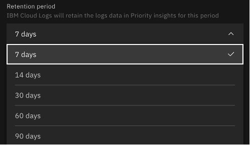
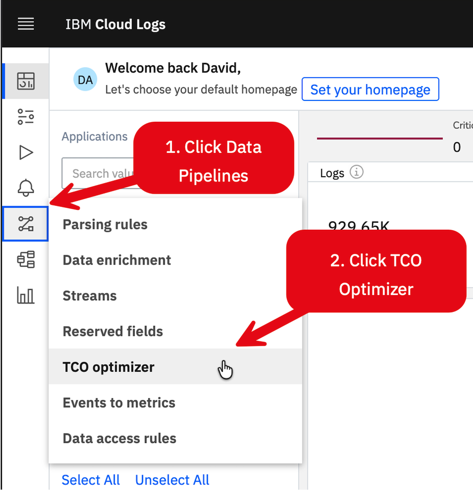
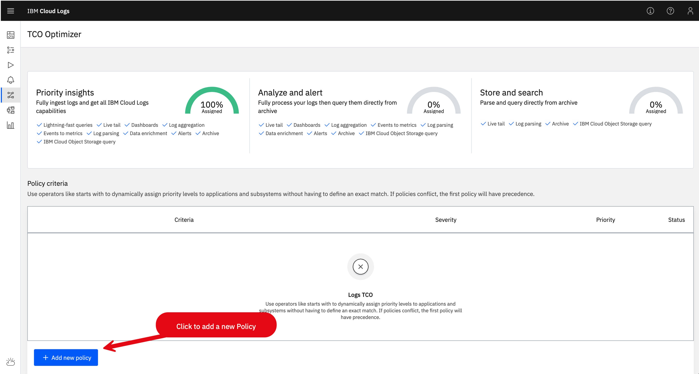
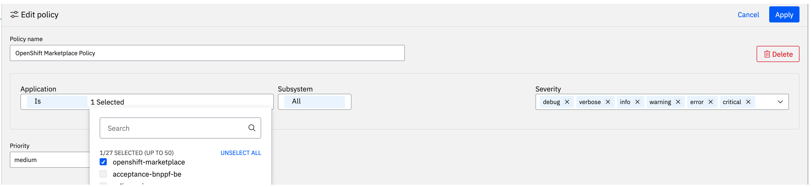
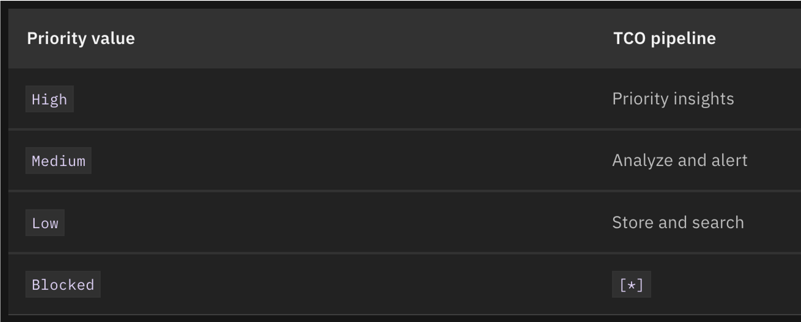

---

copyright:
  years: 2020, 2026
lastupdated: "2026-06-22"

keywords:

subcollection: framework-financial-services

---

{{site.data.keyword.attribute-definition-list}}

# {{site.data.keyword.logs_full_notm}} best practices for Financial Services
{: #shared-logging-best-practices}

Use these best practices to help you use {{site.data.keyword.logs_full}} features while maintaining Financial Services compliance and reducing costs.
{: shortdesc}

This document is intended for Financial Services compliant ISVs. For general information about using {{site.data.keyword.logs_full_notm}}, see [Getting started with {{site.data.keyword.logs_full_notm}}](/docs/cloud-logs?topic=cloud-logs-getting-started).

## Understanding data retention
{: #data-retention}

When you provision {{site.data.keyword.logs_full_notm}}, you specify a retention period that defines how long log data stays in Priority Insights before being moved to archive in {{site.data.keyword.cos_full_notm}}. This retention period applies only to Priority Insights, not to all log data.

{: caption="{{site.data.keyword.logs_full_notm}} Priority Insights retention period" caption-side="bottom"}

You define the overall retention period for your logs by using {{site.data.keyword.cos_short}}, not {{site.data.keyword.logs_full_notm}}.

### Recommended retention period
{: #recommended-retention}

For most use cases, retain your logs in Priority Insights for **7 days**. This approach provides fast access and searching of log data for the following scenarios:

* Installing and configuring your infrastructure
* Triaging a Severity 1 or 2 incident
* Developing new features and functions where developers can tail logs live

After 7 days in Priority Insights, logs are automatically moved to {{site.data.keyword.cos_short}}. Configure the full retention period for logs on the {{site.data.keyword.cos_short}} bucket when you provision {{site.data.keyword.logs_full_notm}}.

## Configuring IBM Cloud Logs storage
{: #configure-storage}

After you provision {{site.data.keyword.logs_full_notm}}, create two {{site.data.keyword.cos_short}} buckets:

Data storage bucket
:   Stores the raw log data

Metrics storage bucket
:   Stores metrics that are generated from your logs and events

### Creating storage buckets
{: #create-buckets}

To create the two required buckets:

1. Create a new instance of {{site.data.keyword.cos_short}} to hold your buckets. For more information, see [Provisioning an instance of {{site.data.keyword.cos_short}}](/docs/cloud-object-storage?topic=cloud-object-storage-provision#provision-instance).

2. Open your [{{site.data.keyword.cloud_notm}} Resources](https://cloud.ibm.com/resources){: external} page.

3. Expand **Storage** and select your newly created {{site.data.keyword.cos_short}} instance.

4. Click **Create bucket**.

5. In the **Create a Custom Bucket** section, click **Create**.

6. Enter a meaningful name for your bucket.

7. Verify the correct region is selected in Location.

8. Click **Add+** in the **Archive Rule** section under Advanced Configurations.

9. Set **Time to Archive** to 3 years.

10. Click **Save** at the top of the Archive Rule form.

11. Enable **Key management** under Service ingregrations section, configure the encryption key. For more details on configuring the encryption keys, see [Data encryption at rest](docs/framework-financial-services?topic=framework-financial-services-shared-encryption-at-rest).

12. Click **Create bucket*.

13. Repeat these steps to create the second bucket.

### Connecting buckets to IBM Cloud Logs
{: #connect-buckets}

After you create the two buckets, assign them to {{site.data.keyword.logs_full_notm}}:

1. In the {{site.data.keyword.cloud_notm}} console, click the navigation menu and select **Observability** > **Logging**.

2. Click your {{site.data.keyword.logs_full_notm}} instance.

3. Click **Storage** in the navigation menu.

4. In the **Data Bucket** section, click **Connect**.

5. Select your {{site.data.keyword.cos_short}} instance and the bucket that you created for data storage.

6. Click **Connect**.

7. In the **Metrics bucket** section, click **Connect**.

8. Select your {{site.data.keyword.cos_short}} instance and the bucket that you created for metrics storage.

9. Click **Connect**.

## Understanding data tiers
{: #data-tiers}

{{site.data.keyword.logs_full_notm}} offers three tiers of features: Priority Insights, Analyze and Alert, and Storage and Search. For more information about the features that are supported in each tier, see [Data pipelines](/docs/cloud-logs?topic=cloud-logs-tco-optimizer&interface=ui#tco_mapping).

Priority Insights
:   Hot storage where logs are indexed immediately and can be searched at high speed. Priority Insights is the most expensive storage tier.

Analyze and Alert
:   Medium-priority storage for logs that need alerting and analysis capabilities but not immediate indexing.

Storage and Search
:   Archive storage in {{site.data.keyword.cos_short}} where logs can still be searched, but with slower performance than Priority Insights.

To help lower the cost of log storage, {{site.data.keyword.logs_full_notm}} automatically moves your Priority Insights logs to {{site.data.keyword.cos_short}}. You can also define TCO policies to control which logs go to Priority Insights and which logs are sent to other pipelines. For more information, see [Using the TCO Optimizer](#tco-optimizer).

### Data pipeline flow
{: #pipeline-flow}

Each log that you send to {{site.data.keyword.logs_full_notm}} goes through a data pipeline, which defines how that log is:

* Collected
* Processed and enriched
* Stored
* Made available for querying, metrics, and alerts

By default, all logs are sent to Priority Insights. Use the following criteria to decide which pipeline a log belongs to:

| Criteria | Questions to ask | Recommended pipeline |
| --- | --- | --- |
| Operational urgency | Do you need alerts within seconds or minutes? | Analyze and Alert |
| Troubleshooting need | Is this data needed for debugging but not real-time? | Analyze and Alert |
| Compliance retention | Is this log needed only for audit or compliance lookup? | Storage and Search |
| Volume and verbosity | Is this a high-volume debug or trace log? | Storage and Search |
| Business importance | Does it represent a business-critical transaction or error? | Priority Insights |
| Query frequency | How often do you query it? Hourly? Rarely? | Frequent: Priority Insights or Analyze and Alert; Rare: Storage and Search |
{: caption="Data pipeline selection criteria" caption-side="bottom"}

## Sending logs to IBM Cloud Logs
{: #sending-logs}

Send {{site.data.keyword.cloud_notm}} platform application, infrastructure, and operational logs to your {{site.data.keyword.logs_full_notm}} instance. Follow each section to ensure that you capture all Financial Services required logging.

### Activity Tracker event routing (required)
{: #activity-tracker-routing}

{{site.data.keyword.at_full_notm}} captures auditable events in each region of {{site.data.keyword.cloud_notm}} and is required for Financial Services compliance. The Activity Tracker Event Routing service allows you to send the collected events to {{site.data.keyword.logs_full_notm}} for searching, alerting, and analysis.

After you provision {{site.data.keyword.logs_full_notm}}, create an {{site.data.keyword.at_short}} event route:

1. Create an [{{site.data.keyword.at_short}} event route](/docs/atracker?topic=atracker-getting-started) that routes events to your {{site.data.keyword.logs_full_notm}} instance.

2. [Install the Activity Tracker extension](/docs/cloud-logs?topic=cloud-logs-extensions-activity-tracking) for {{site.data.keyword.logs_full_notm}}. The extension includes predefined dashboards, alerts, and rules.

For more information about searching and managing auditable events that are sent from Activity Tracker, see [Activity Tracking events for {{site.data.keyword.logs_full_notm}}](/docs/cloud-logs?group=observability).

### Application logs (required)
{: #application-logs}

Application logs are sent to {{site.data.keyword.logs_full_notm}} by using the {{site.data.keyword.logs_full_notm}} agent. The agent is installed on a compute resource where it can be configured to capture and send logs from running applications.

Start capturing application logs by first configuring your application name and subsystem name in {{site.data.keyword.logs_full_notm}}. For more information, see [Configuring the {{site.data.keyword.logs_full_notm}} agent to set application and subsystem names](/docs/cloud-logs?topic=cloud-logs-agent-set-appsubname).

After you configure the application and subsystem, follow the instructions for your compute platform:

{{site.data.keyword.openshiftlong_notm}}
:   Install the [{{site.data.keyword.logs_full_notm}} agent on {{site.data.keyword.openshiftshort}} by using Helm](/docs/cloud-logs?topic=cloud-logs-agent-helm-os-deploy).

Linux
:   Install the [{{site.data.keyword.logs_full_notm}} agent on Linux servers](/docs/cloud-logs?topic=cloud-logs-agent-linux).

Windows
:   Install the [{{site.data.keyword.logs_full_notm}} agent on Windows servers](/docs/cloud-logs?topic=cloud-logs-agent-windows).

### IBM Cloud service logs (required)
{: #service-logs}

{{site.data.keyword.cloud_notm}} services automatically send logs to {{site.data.keyword.logs_full_notm}}. However, some services offer additional logging features that are required for Financial Services compliance. If you use the services that are listed in the following table, follow the instructions for required configuration.

| {{site.data.keyword.cloud_notm}} service | Required configuration |
| --- | --- |
| {{site.data.keyword.databases-for-postgresql_full_notm}} | Enable [PostgreSQL pgaudit](/docs/databases-for-postgresql?topic=databases-for-postgresql-pgaudit). |
| {{site.data.keyword.databases-for-mongodb_full_notm}} | Provision with the [Enterprise plan](/docs/databases-for-mongodb?topic=databases-for-mongodb-mongodb-plans) for audit logs to be sent to {{site.data.keyword.logs_full_notm}} automatically. |
| {{site.data.keyword.databases-for-elasticsearch_full_notm}} | Provision with the [Platinum plan](/docs/databases-for-elasticsearch?topic=databases-for-elasticsearch-elastic-offerings#es-plan-feature-comparison) for Kibana audit logging. |
| {{site.data.keyword.openshiftlong_notm}} | Enable [audit logging](/docs/openshift?topic=openshift-health-audit#audit-api-server). |
{: caption="Required service logging configuration" caption-side="bottom"}

### IBM Cloud Logs extensions (optional)
{: #logs-extensions}

Several extensions are available for {{site.data.keyword.logs_full_notm}} that define alerts, rules, and dashboards for {{site.data.keyword.cloud_notm}} services.

While not required, investigate whether any of the extensions would be useful for your use case. For more information, see the [complete list of {{site.data.keyword.logs_full_notm}} extensions](/docs/cloud-logs?topic=cloud-logs-extensions#extensions-ibm).

## Using the TCO Optimizer
{: #tco-optimizer}

With the {{site.data.keyword.logs_full_notm}} TCO Optimizer, you can define how logs are distributed across the three data pipelines to keep log storage costs low. You create policies in the TCO Optimizer, and each policy determines which of the three data pipelines log data flows to based on the log's application, subsystem, and severity.

You must have a {{site.data.keyword.cos_short}} bucket provisioned and configured to archive your logs before you create a policy. For more information, see [Configuring a bucket for {{site.data.keyword.logs_full_notm}}](/docs/cloud-logs?topic=cloud-logs-configure-data-bucket).
{: important}

### Recommended TCO policies
{: #recommended-policies}

To achieve the lowest possible cost for log storage by using the TCO Optimizer, create the following policies:

| Policy name | Application | Subsystem | Severity | Priority |
| --- | --- | --- | --- | --- |
| Storage and Search by default | All | All | All | Low |
| Analyze and Alert logs | One or more applications | All | All | Medium |
| Highest priority logs | One or more applications | One or more subsystems | Critical, Error | High |
{: caption="Recommended TCO Optimizer policies" caption-side="bottom"}

With these three policies:

* All logs are sent to the Storage and Search data pipeline by default
* Logs that match the application that is defined in the Analyze and Alert logs policy are sent to the medium-priority Analyze and Alert data pipeline
* Logs that match the application or subsystem that is defined in the Highest priority logs policy with Critical or Error severity are sent to the Priority Insights data pipeline (most costly)

### Accessing the TCO Optimizer
{: #access-tco-optimizer}

To access the TCO Optimizer:

1. Log in to your {{site.data.keyword.cloud_notm}} account.

2. Click the navigation menu and select **Observability** > **Logging**.

3. Click the logging instance that you want to work with.

4. Click **Open Dashboard**.

5. In the dashboard navigation, click **Data Pipelines** > **TCO Optimizer**.

{: caption="TCO Optimizer menu" caption-side="bottom"}

### Creating a TCO policy
{: #create-tco-policy}

The following example shows how to create a TCO Optimizer policy that sends all logs from the "OpenShift Marketplace" application to the Analyze and Alert data pipeline.

1. In the TCO Optimizer, click **Add new policy**.

{: caption="Adding new TCO Optimizer policy" caption-side="bottom"}

2. Enter a policy name, for example, "OpenShift Marketplace Policy".

3. Select the application, subsystem, and severity of the logs that the policy applies to. In this example, "OpenShift Marketplace" is selected as the application with all subsystems and all severities.

{: caption="Selecting new TCO Optimizer policy attributes" caption-side="bottom"}

4. Set the priority for the policy. The priority determines the pipeline for logs that are matched by the policy. In this example, select **Medium** to send OpenShift Marketplace logs to Analyze and Alert.

{: caption="Selecting new policy priority" caption-side="bottom"}

   Choosing **High** priority sends logs to Priority Insights, the most expensive data pipeline.
   {: important}

5. Click **Apply**.

## Next steps
{: #next-steps}

After you create the TCO Optimizer policies and configure the {{site.data.keyword.logs_full_notm}} agent to supply application and subsystem names, your log data is sent to the appropriate {{site.data.keyword.logs_full_notm}} data pipelines.

You can continue to configure {{site.data.keyword.logs_full_notm}} to your specifications:

* [Using Live Tail to tail logs](/docs/cloud-logs?topic=cloud-logs-livetail)
* [Explore the {{site.data.keyword.logs_full_notm}} dashboard and create your own custom dashboards](/docs/cloud-logs?topic=cloud-logs-about_dashboards#about_dashboard_home)
* [Automatically set severity level metadata of log messages with the log agent](/docs/cloud-logs?topic=cloud-logs-agent-set-appsubname#agent-set-appsubname-5)
* [Create and manage alerts](/docs/cloud-logs?group=managing-alerts)
* [Configure extensions in {{site.data.keyword.logs_full_notm}} for monitoring {{site.data.keyword.databases-for-mysql_full}} or {{site.data.keyword.databases-for-postgresql_full_notm}}](/docs/cloud-logs?topic=cloud-logs-extensions)

## Related information
{: #related-info}

* [{{site.data.keyword.logs_full_notm}} documentation](/docs/cloud-logs?topic=cloud-logs-getting-started)
* [{{site.data.keyword.logs_full_notm}} FAQ](/docs/cloud-logs?topic=cloud-logs-faq)
* [{{site.data.keyword.logs_full_notm}} API](/apidocs/logs-service-api)
* [Alerting in {{site.data.keyword.logs_full_notm}}](/docs/cloud-logs?topic=cloud-logs-alerts)
* [Routing logs](/docs/logs-router?topic=logs-router-about)
* [{{site.data.keyword.databases-for-postgresql_full_notm}} - Enable logging](/docs/databases-for-postgresql?topic=databases-for-postgresql-logging#log-enable)
* [{{site.data.keyword.cloud_notm}} for Financial Services](https://www.ibm.com/cloud/financial-services){: external}
