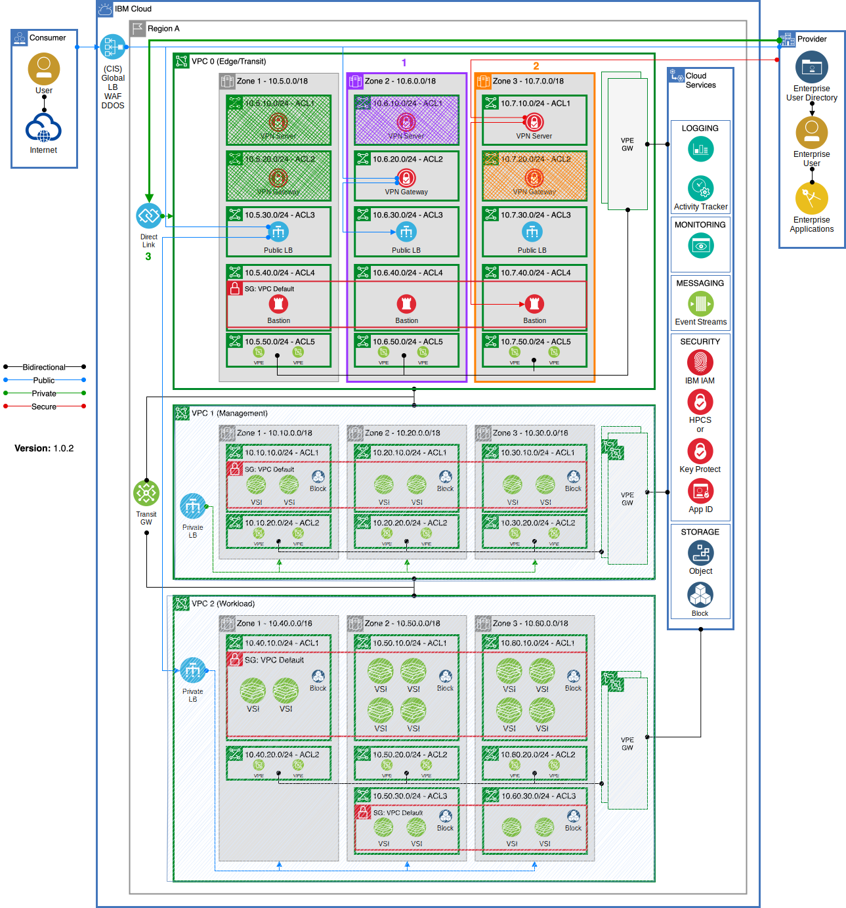

---

copyright:
  years: 2020, 2025
lastupdated: "2025-02-25"

keywords:

subcollection: framework-financial-services

---

{{site.data.keyword.attribute-definition-list}}

# Single-region {{site.data.keyword.cloud_notm}} for Financial Services reference architecture for VPC with {{site.data.keyword.vsi_is_short}}
{: #vpc-architecture-detailed-vsi}

Now that you've seen the [high-level VPC reference architecture for {{site.data.keyword.cloud_notm}} for Financial Services](/docs/framework-financial-services?topic=framework-financial-services-vpc-architecture-about) and looked at some [VPC concepts](/docs/framework-financial-services?topic=framework-financial-services-vpc-architecture-concepts), we will take a deeper look at some of the details of a reference architecture that uses virtual servers.
{: shortdesc}

This architecture shows a deployment of the VPC that uses {{site.data.keyword.vsi_is_short}} as the primary compute.

## Architecture diagram
{: #vpc-vsi-diagram}

{: caption="Single-region {{site.data.keyword.cloud_notm}} for Financial Services reference architecture for VPC with {{site.data.keyword.vsi_is_short}}" caption-side="bottom"}

## Management VPC
{: #vpc-architecture-detailed-management}

### Regions and zones
{: #vpc-architecture-detailed-management-regions-zones}

The management VPC provides compute, storage, and network services to enable application provider administrators to monitor, operate, and maintain the environment. The intent is to completely isolate management operations from the VPC running consumer workloads.

The management VPC is distributed across three zones in one [multizone region (MZR)](/docs/overview?topic=overview-locations#mzr-table). Each zone contains two subnets that are protected by different ACLs.

### Subnets for management tools
{: #vpc-architecture-detailed-management-subnets}

The top subnet in each zone is part of the default security group for the VPC. And, each of those subnets contains an arbitrary number of virtual server instances that use {{site.data.keyword.block_storage_is_short}}. These instances are where your management tools run. 

The lower subnets in the diagram relate to inbound connectivity, and we'll cover more about that in the next sections.

### Connectivity inbound to VPC
{: #vpc-architecture-detailed-management-connectivity-inbound}

Connectivity from your application provider's enterprise environment to the management VPC is accomplished by using {{site.data.keyword.dl_full_notm}} or {{site.data.keyword.cloud_notm}} {{site.data.keyword.vpn_vpc_full}}. You must use one or the other.

[{{site.data.keyword.dl_short}}](/docs/dl?topic=dl-dl-about) is the most secure way to enable connectivity from the application provider's on-premises environment to the management VPC. The speed and reliability of {{site.data.keyword.dl_short}} extends your organization’s data center network and offers more consistent, higher-throughput connectivity, keeping traffic within the {{site.data.keyword.cloud_notm}} network. When using {{site.data.keyword.dl_short}}, a private [{{site.data.keyword.alb_full}} (ALB)](/docs/vpc?topic=vpc-load-balancers) is used to distribute traffic among multiple server instances within the same region of your VPC.

An alternative connectivity pattern requires use of the [{{site.data.keyword.vpn_vpc_short}}](/docs/vpc?topic=vpc-using-vpn) service to securely connect from your private network to the management VPC. {{site.data.keyword.vpn_vpc_short}} can be used as a static, route-based VPN or a policy-based VPN to set up an IPsec site-to-site tunnel between your VPC and your on-premises private network, or another VPC. When using {{site.data.keyword.vpn_vpc_short}}, you need to place the gateway in a subnet (shown in the lower left subnet in the diagram).

### Bastion host
{: #vpc-architecture-detailed-management-connectivity-vpn}

Regardless of whether you are using {{site.data.keyword.dl_short}} or {{site.data.keyword.vpn_vpc_short}} to connect to the management VPC, you need to ensure that all traffic is routed through a bastion host with session recording. The bastion host solution is depicted in the two rightmost lower subnets in the diagram.

### Connectivity between VPCs
{: #vpc-architecture-detailed-management-connectivity}

The management VPC needs to connect to the workload VPC to deploy, configure, and operate the components and workloads that are found in the workload VPC. [{{site.data.keyword.tg_short}}](/docs/transit-gateway?topic=transit-gateway-about) is designed specifically for this purpose, and is the means for connecting your management VPC to your workload VPC.

## Workload VPC
{: #vpc-architecture-detailed-workload}

The workload VPC provides compute, storage, and network services to support hosted applications and operations that deliver services to the consumer. Let's take a closer look at the components within the VPC.

### Regions and zones
{: #vpc-architecture-detailed-regions-zones}

Just like the management VPC, the workload VPC is spread across three zones. The workload VPC should be created in the same MZR as the management VPC.

### Connectivity to workload VPC
{: #vpc-architecture-detailed-workload-connectivity}

If the consumer is in the same organization as the application provider, then just like for the management VPC, {{site.data.keyword.dl_short}} can provide access to the workload VPC. Alternatively, {{site.data.keyword.vpn_vpc_short}} can be used for site-to-site VPN connectivity.

### Storage and encryption
{: #vpc-architecture-detailed-services-encryption}

#### {{site.data.keyword.block_storage_is_short}}
{: #vpc-architecture-detailed-services-encryption-block-storage}

{{site.data.keyword.block_storage_is_short}} is automatically created for the primary book volume when you create a virtual server. You can also create more data volumes by using {{site.data.keyword.block_storage_is_short}} within any subnet.

By default, all boot and data volumes are encrypted at rest with IBM-managed encryption. There is no additional cost for this service. IBM-managed encryption uses the following industry standard protocols:

* AES-256 encryption
* Keys are managed in-house with Key Management Interoperability Protocol (KMIP)

For all sensitive and consumer-owned data, the application provider should use customer-managed encryption. With this encryption method you can bring your own customer root key (CRK) to the cloud or have a key management service (KMS) generate a key for you. For {{site.data.keyword.cloud_notm}} for Financial Services, the supported key management service is [{{site.data.keyword.hscrypto}} (HPCS)](/docs/hs-crypto?topic=hs-crypto-overview). Root keys encrypt volume and custom image passphrases with envelope encryption, a process that encrypts a key with another key.

#### {{site.data.keyword.cos_short}}
{: #vpc-architecture-detailed-services-encryption-cos}

[{{site.data.keyword.cos_short}}](/docs/cloud-object-storage?topic=cloud-object-storage-about-cloud-object-storage) is an alternative storage option that is useful for certain use cases, including backup and recovery, data archiving, cloud-native application building, and AI and big data analytics. {{site.data.keyword.cos_short}} stores encrypted and dispersed data across multiple geographic locations.

By default, all objects that are stored in {{site.data.keyword.cos_short}} are encrypted by using randomly generated keys and an all-or-nothing-transform (AONT). While this default encryption model provides at-rest security, financial service workloads need full control over the data encryption keys used. Again, {{site.data.keyword.hscrypto}} should be used for this purpose.

### Using {{site.data.keyword.cloud_notm}} services outside of a VPC
{: #vpc-architecture-detailed-connectivity-services}

With [{{site.data.keyword.cloud_notm}} {{site.data.keyword.vpe_full}}](/docs/vpc?topic=vpc-about-vpe) you can connect to supported {{site.data.keyword.cloud_notm}} services from your VPC network by using the IP addresses of your choosing, which is allocated from a subnet within your VPC. In the reference architecture diagram, VPEs appear in the middle subnets of the workload VPC.

{{site.data.content.service-description-vpe-2}}

## Variation with edge/transit VPC for public internet access
{: #edge-vpc-architecture}

You might want to allow consumers to access your service through the public internet. This base architecture can be adapted to securely enable this type of access as shown in the following diagram, which introduces a new edge VPC. The request from the consumer gets routed through a global load balancer, through a web application firewall in the edge VPC, and then to the public application load balancer within the workload VPC.

{: caption="Single-region {{site.data.keyword.cloud_notm}} for Financial Services reference architecture for VPC with BIG-IP" caption-side="bottom"}

For complete details on this variation of the architecture, see [Consumer connectivity to workload VPC](/docs/framework-financial-services?topic=framework-financial-services-vpc-architecture-connectivity-workload#consumer-provider-public-internet).

## Next steps
{: #next-steps}

If you plan to use {{site.data.keyword.openshiftlong_notm}}, explore a more detailed view of the [VPC reference architecture with {{site.data.keyword.openshiftshort}}](/docs/framework-financial-services?topic=framework-financial-services-vpc-architecture-detailed-openshift)

If you don't plan to use {{site.data.keyword.openshiftlong_notm}}, you can skip ahead to learn more about deployment in [Setup environment for deployment and configuration](/docs/framework-financial-services?topic=framework-financial-services-shared-deployment-setup-environment).
