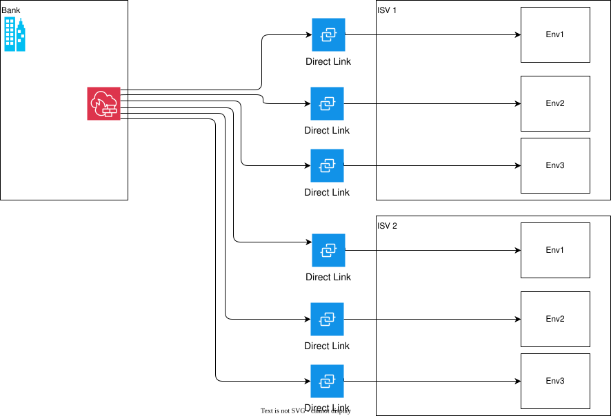
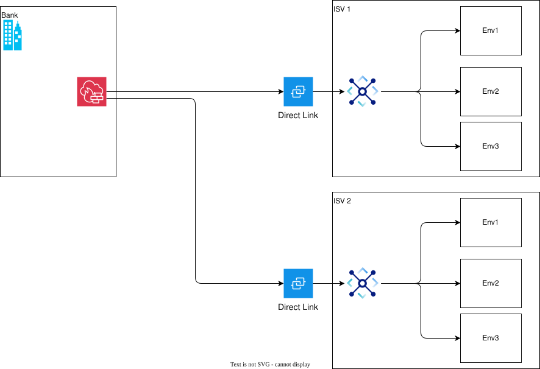
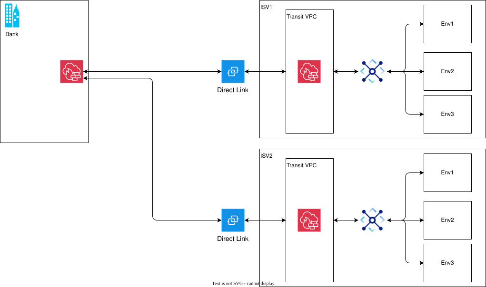
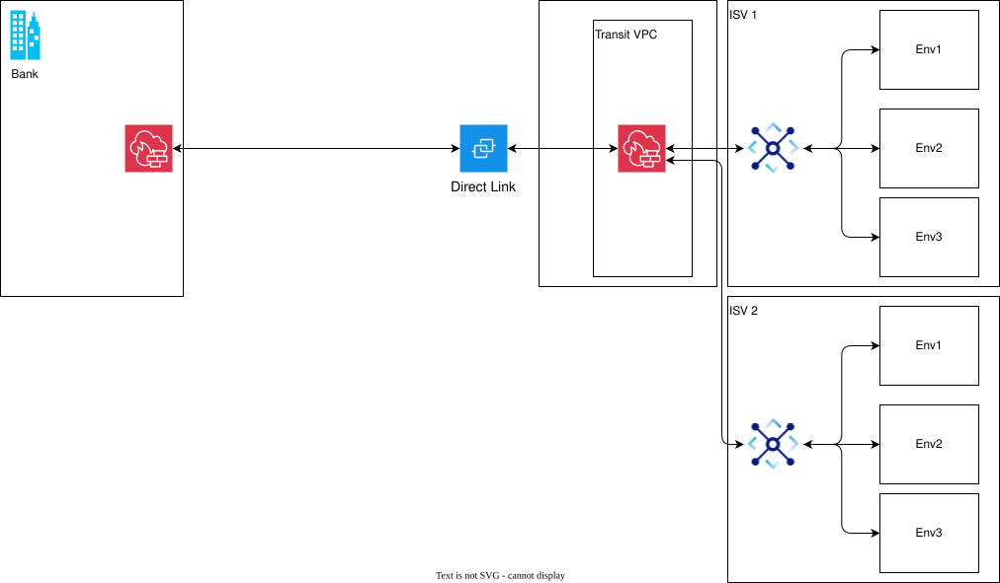
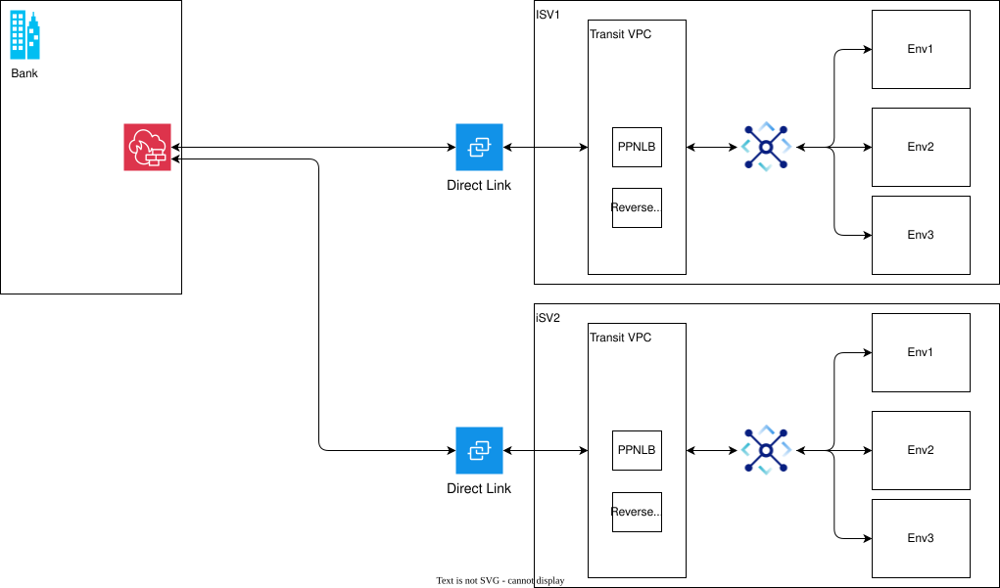
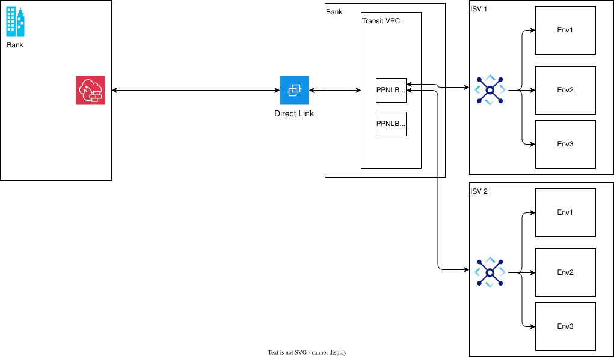

---

copyright:
  years: 2020, 2026
lastupdated: "2026-06-18"

keywords:

subcollection: framework-financial-services

---

{{site.data.keyword.attribute-definition-list}}

# Connecting on-prem environment with service providers on IBM Cloud with {{site.data.keyword.dl_short}}
{: #vpc-architecture-connectivity-direct-link}

{{site.data.keyword.dl_short}} can provide a secure and dedicated netowork connection between on-prem environment ("Bank") and ISV Cloud account for the ISV to access on-prem services (Bank information systems).
{: shortdesc}

## Assumptions
{: #assumptions}

- ISV uses 1 account for multiple workload environments
- VPCs are used for isolation between workload environments
- Internet connectivity to and from the ISV VPCs still follows the regular pattern using Public GW and CIS
- Bank provides the right access to onprem services.
- Bank willing to provides the IP address for the VPC connected to {{site.data.keyword.dl_short}}
- ISV and the Bank are two distinct organizations, with isolated networking boundaries.

## Alternatives
{: #alternatives}

- One {{site.data.keyword.dl_short}} per VPC (1 per VPC - Management, Workload)
- One {{site.data.keyword.dl_short}} per provider connected through Transit Gateway to multiple VPCs(Edge, Management, Workload)
- **Recommended**: One {{site.data.keyword.dl_short}} per provider → Transit VPC (with Proxy/Firewall) managed by provider → Transit Gateway → Multiple VPCs(Different environment Access)
- Overall one {{site.data.keyword.dl_short}} → Transit VPC (with Proxy/Firewall) managed by consumer → Transit Gateway → Multiple VPCs (Several ISV and their Environment Access)
- One {{site.data.keyword.dl_short}} per provider → Transit VPC (with PPNLB) managed by provider → Transit Gateway → Multiple VPCs (Different environment Access)
- Overall one {{site.data.keyword.dl_short}} → Transit VPC (with PPNLB) managed by consumer → Transit Gateway → Multiple VPCs(Several ISV and their Environment Access)

## One {{site.data.keyword.dl_short}} per VPC/environment
{: #dl-per-vpc}

One {{site.data.keyword.dl_short}} per each Environment or VPC - for example, Management, Workload, etc.

{: caption="One {{site.data.keyword.dl_short}} per each Environment or VPC" caption-side="bottom"}

* **Advantages**:
   - **Isolation**: Strong security isolation between VPCs.
   - **No interdependence**: Each link is independent; failures don't affect other VPCs.
   - **Lower intra-VPC complexity**: No need for routing across VPCs.

* **Disadvantages**:
   - **Expensive**: Multiple {{site.data.keyword.dl_short}} connections = higher port, hosting, and operational costs.
   - **Scalability challenge**: Hard to scale with more VPCs.
   - **Management complexity**: More effort required to manage multiple DLs, FW, SGs, ACLs, IP blocks, and routes.
   - **IPAM**: IP blocks need to be provided by the bank if bank wants to publish 0.0.0.0/0 route for {{site.data.keyword.dl_short}} (in all cases non overlapping IP Blocks will  be required to avoid IP conflict for each VPC directly connected to the {{site.data.keyword.dl_short}} )

## One {{site.data.keyword.dl_short}} per provider connected through Transit Gateway to multiple VPCs
{: #dl-per-provider}

One {{site.data.keyword.dl_short}} per provider connected through Transit Gateway to multiple VPCs (Edge, Management, Workload)

{: caption="One {{site.data.keyword.dl_short}} per provider" caption-side="bottom"}

* **Advantages**:
   - **Cost-effective**: Only one {{site.data.keyword.dl_short}}, reducing port & hosting costs.
   - **Scalable**: Easy to add/remove VPCs via Transit Gateway.
   - **Centralized routing**: Simplifies network architecture and operations.
   - **Lower operational overhead**: Managed connectivity using IBM Transit Gateway.

* **Disdvantages**:
   - **Latency variation**: Traffic hops through Transit Gateway may introduce slight latency.
   - **Security considerations**: Shared connectivity may require additional segmentation/policies, specially since this could expose the DL to Edge VPC
   - **IPAM** – IP blocks need to be provided by the bank if bank wants to publish 0.0.0.0/0 route for {{site.data.keyword.dl_short}} (in all cases non overlapping IP Blocks will  be required to avoid IP conflict for each VPC directly connected to the {{site.data.keyword.dl_short}} )

## One {{site.data.keyword.dl_short}} per provider to Transit VPC managed by provider
{: #dl-per-tgw-provider}

One {{site.data.keyword.dl_short}} per provider → Transit VPC (with Proxy/Firewall) managed by provider → Transit Gateway → Multiple VPCs

{: caption="One {{site.data.keyword.dl_short}} per provider to Transit VPC managed by provider" caption-side="bottom"}

* **Advantages**:
   - **Security layer**: Centralized inspection via proxy/firewall in Transit VPC.
   - **Policy enforcement**: Unified control over outbound/inbound access.
   - **Cost optimization**: One {{site.data.keyword.dl_short}} reused for all VPCs.
   - **IPAM**: IP Conflict taken care of by NATing / Proxying. Still requires IP block assignment by Bank for Transit VPC if bank wants to publish 0.0.0.0/0 route for {{site.data.keyword.dl_short}}. In all cases non overlapping IP Blocks will  be required to avoid IP conflict for each VPC directly connected to the {{site.data.keyword.dl_short}}.

* **Disdvantages**:
   - **Performance bottleneck**: Transit VPC may become a chokepoint if not scaled properly.
   - **Single point of failure**: Proxy/FW failure impacts all traffic.
   - **Operational complexity**: Requires maintaining and scaling the services in Transit VPC.
   - **FW Licensing Costs**

## Overall one {{site.data.keyword.dl_short}} to Transit VPC managed by consumer
{: #dl-per-tgw-consumer}

Overall one {{site.data.keyword.dl_short}} → Transit VPC (with Proxy/Firewall) managed by consumer → Transit Gateway → Multiple VPCs

{: caption="Overall one {{site.data.keyword.dl_short}} to Transit VPC managed by consumer" caption-side="bottom"}

* **Advantages**:
   - **Security layer**: Centralized inspection via proxy/firewall in Transit VPC.
   - **Policy enforcement**: Unified control over outbound/inbound access.
   - **Cost optimization**: One {{site.data.keyword.dl_short}} reused for all VPCs.
   - **IPAM**: IP Conflict taken care of by NATing / Proxying. Still requires IP block assignment by Bank for Transit VPC if bank wants to publish 0.0.0.0/0 route for {{site.data.keyword.dl_short}}. In all cases non overlapping IP Blocks will  be required to avoid IP conflict for each VPC directly connected to the {{site.data.keyword.dl_short}}.

* **Disdvantages**:
   - **Performance bottleneck**: Transit VPC may become a chokepoint if not scaled properly.
   - **Single point of failure**: Proxy/FW failure impacts all traffic.
   - **Increased management burden**: Consumer must manage Transit VPC, Proxy/Firewall, and route propagation. Responsibility of service availability and performance lies with the consumer.
   - **FW Licensing Costs**

## One {{site.data.keyword.dl_short}} per provider to Private Path managed by provider
{: #dl-per-provider-ppnlb}

One {{site.data.keyword.dl_short}} per provider → Transit VPC (with PPNLB) managed by provider → Transit Gateway → Multiple VPCs

{: caption="One {{site.data.keyword.dl_short}} per provider to Private Path managed by provider" caption-side="bottom"}

* **Advantages**:
   - **Abstracted access to ISV services**: VPCs can use the same "connector" without direct internet exposure.
   - **Security**: ISV services accessed through a controlled environment (Private Path).
   - **Cost-effective**: One {{site.data.keyword.dl_short}} and centralized access.
   - **IPAM**: IP Conflict taken care of by NATing / Proxying. Still requires IP block assignment by Bank for Transit VPC if bank wants to publish 0.0.0.0/0 route for {{site.data.keyword.dl_short}}. In all cases non overlapping IP Blocks will  be required to avoid IP conflict for each VPC directly connected to the {{site.data.keyword.dl_short}}.

* **Disdvantages**:
   - **Performance bottleneck**: Transit VPC may become a chokepoint if not scaled properly.

## Overall one {{site.data.keyword.dl_short}} to Private Path managed by consumer
{: #dl-consumer-ppnlb}

Overall one {{site.data.keyword.dl_short}} → Transit VPC (with PPNLB) managed by consumer → Transit Gateway → Multiple VPCs(Several ISV and their environment access)

{: caption="Overall One {{site.data.keyword.dl_short}} to Private Path managed by consumer" caption-side="bottom"}

* **Advantages**:
   - **Consumer control**: Full control over Private Path connectivity, routing, and security policies.
   - **Security segmentation**: ISV services accessed via a consumer-trusted middle layer.
   - **Auditing & compliance**: Easier to monitor and enforce consumer-side policies.
   - **IPAM**: IP Conflict taken care of by NATing / Proxying. Still requires IP block assignment by Bank for Transit VPC if bank wants to publish 0.0.0.0/0 route for {{site.data.keyword.dl_short}}. In all cases non overlapping IP Blocks will  be required to avoid IP conflict for each VPC directly connected to the {{site.data.keyword.dl_short}}.

* **Disdvantages**:
   - **Performance bottleneck**: Transit VPC may become a chokepoint if not scaled properly.
   - **Increased management burden**: Consumer must manage Transit VPC, Private Path, and route propagation. Responsibility of service availability and performance lies with the consumer.
   - **Single point of failure**: Proxy/FW failure impacts all traffic.

## Comparison Summary
{: #comparison}

| Architecture | Cost Efficiency | Scalability | Security | Complexity | Latency | Reliability |
| --- | --- | --- | --- | --- | --- | --- |
| One {{site.data.keyword.dl_short}} per VPC (1 per VPC - Mgmt, Wrkld..) | ❌ Low | ❌ Low | ✅ High | ❌ High | ✅ Low | ✅ High |
| One {{site.data.keyword.dl_short}} per provider connected through Transit Gateway to multiple VPCs(Edge, Mgmt, Wrkld..) | ⚠️ Medium | ⚠️ Medium | ⚠️ Medium | ✅ Low | ⚠️ Medium | ⚠️ Medium |
| One {{site.data.keyword.dl_short}} per provider → Transit VPC (with Proxy/Firewall) managed by provider → Transit Gateway → Multiple VPCs(Different environment Access) | ⚠️ Medium | ⚠️ Medium | ✅ High | ⚠️ Medium | ⚠️ Medium | ⚠️ Medium |
| Overall one {{site.data.keyword.dl_short}} → Transit VPC (with Proxy/Firewall) managed by consumer → Transit Gateway → Multiple VPCs (Several ISV and their Environment Access) (**Recommended**)| ✅ High | ✅ High | ✅ High | ⚠️ Medium | ⚠️ Medium | ⚠️ Medium |
| One {{site.data.keyword.dl_short}} per provider → Transit VPC (with PPNLB) managed by provider → Transit Gateway → Multiple VPCs(Different environment Access) | ✅ High | ✅ High | ✅ High | ⚠️ Medium | ⚠️ Medium | ⚠️ Medium |
| Overall one {{site.data.keyword.dl_short}} → Transit VPC (with PPNLB) managed by consumer → Transit Gateway → Multiple VPCs(Several ISV and their Environment Access) | ✅ High | ✅ High | ✅ Very High | ❌ High | ⚠️ Medium | ⚠️ Medium |
{: caption="Comparison of {{site.data.keyword.dl_short}} deployment alternatives" caption-side="bottom"}

## FS guidance for accessing workloads from private intranet
{: #fs-guidance}

* Workloads may need access from private intranets using VPN or {{site.data.keyword.dl_short}}.
* **VPN Options**: Client-to-Site and Site-to-Site VPNs support NATing.
* **{{site.data.keyword.dl_short}} Considerations**:
   - Requires careful IP space coordination to avoid conflicts.
   - Both consumer and provider must align on VPC IP ranges.
* **Recommended Setup**: (One {{site.data.keyword.dl_short}} per provider → Transit VPC (with Proxy/Firewall) managed by provider → Transit Gateway → Multiple VPCs):
   - Connect {{site.data.keyword.dl_short}} to a Transit VPC.
   - Use a firewall device in the Transit VPC for NATing.
   - Enables secure and conflict-free workload access.
   - For DNS resolution,
      - If the on-prem environment allowes, a DNS forwarding can be setup using IBM Cloud Private DNS Resolver deployed by ISV in the VPC to forward queries about specific FQDNS/domains to the bank internal DNS.
         - Full Direct Access (with security setup at the internal DNS)
         - 2 Stage – DMZ DNS forwarding to on-prem Internal DNS
      - Alternatively, if allowed by on-prem environment, a non-authoritative zone(alias) can be setup using IBM Cloud Private DNS Resolver which resolves to the appropriate bank internal FQDNS (potential issue : Out of sync DNS records)

See also [Consumer connectivity to workload VPC](/docs/framework-financial-services?topic=framework-financial-services-vpc-architecture-connectivity-workload#connecting-from-private-intranet)

## Next steps
{: #next-steps}

* [Data loss prevention and perimeter access patterns](/docs/framework-financial-services?topic=framework-financial-services-vpc-architecture-connectivity-dlp)
