---

copyright:
  years: 2020, 2026
lastupdated: "2026-06-18"

keywords:

subcollection: framework-financial-services

---

{{site.data.keyword.attribute-definition-list}}

# Data loss prevention and perimeter access patterns
{: #vpc-architecture-connectivity-dlp}

Learn about the data loss prevention strategies with a focus on perimeter access patterns for Independent Software Vendor (ISV) deployments in {{site.data.keyword.cloud_notm}} for Financial Services, including security enforcements, architectural decisions, and threat mitigations.
{: shortdesc}

## Overview
{: #perimeter-access-overview}

This guidance defines the use cases and deployment patterns for ISVs to follow when implementing perimeter access controls in {{site.data.keyword.cloud_notm}} for Financial Services environments. The patterns address various access scenarios including application users, cloud administrators, and cross-account connectivity.

## ISV actors and access patterns
{: #isv-actors}

The following table describes the different types of actors in an ISV deployment and their access patterns:

| Actor | Privilege level | Access path | Components accessed |
| ----- | --------------- | ----------- | ------------------- |
| Application User | Non-privileged user | Internet access to application | User-facing application components only |
| Application Admin | Privileged user | Internet access to admin console | Administrative application components |
| Cloud Admin | Privileged user | VPN and bastion host for cloud resources; internet for Cloud console | Cloud resources within assigned permissions |
| Service ID ( Machine-to-machine ) | Privileged user  | VPN, trusted profiles | Management VPC resources |
{: caption="ISV actor types and access patterns" caption-side="bottom"}

## Use cases
{: #use-cases}

This guidance covers the following perimeter access use cases:

* Application users (non-privileged) accessing applications in the workload VPC
* Cloud administrators (privileged) accessing cloud resources in the ISV cloud account
* Application administrators (privileged) accessing application admin resources for applications running in workload VPC
* Cloud administrators (privileged) accessing the {{site.data.keyword.cloud_notm}} console
* Connectivity
   * VPC connectivity using Transit Gateway within the same account
   * VPC connectivity using Transit Gateway across different accounts
   * Internet access using Public Gateway
   * Client-to-site VPN connections from ISV to cloud account
   * Site-to-site VPN connections for privileged access
   * {{site.data.keyword.dl_short}} connectivity

## Reference deployment architecture
{: #reference-architecture}

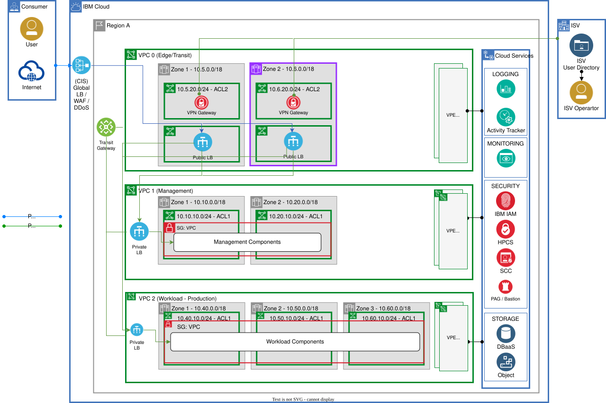{: caption="Reference deployment architecture" caption-side="bottom"}

The ISV reference deployment architecture consists of three primary VPCs:

Edge VPC
:   Hosts application load balancers, bastion hosts, and VPN gateways. Deployed across 2 availability zones in active-active mode.

Management VPC
:   Contains management and operational tools. Deployed across 2 availability zones.

Workload VPC
:   Hosts the application workloads. Deployed across 2 or 3 availability zones depending on required SLA.

All cloud services are accessed from VPCs using Virtual Private Endpoints (VPEs), which are deployed for each VPC.

## Application user access (non-privileged)
{: #application-user-access}

Application users access the application through the internet with multiple layers of security enforcement.

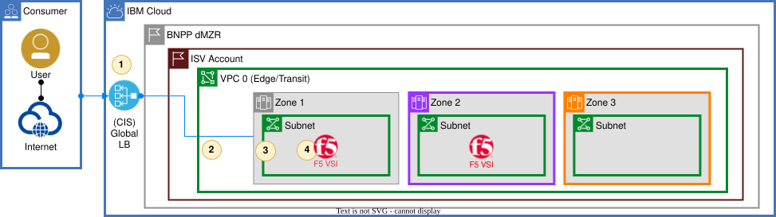{: caption="Application user access (non-privileged)" caption-side="bottom"}

### Security enforcements
{: #app-user-enforcements}

The following security enforcements are in place for application user access:

1. {{site.data.keyword.cis_full_notm}}:   Provides Layer 3 DDoS protection, DNSSec, IP firewall (ASN/Region/CIDR filtering), and load balancing.

2. VPC network ACLs:   Allow IP addresses only from {{site.data.keyword.cis_short}}.

3. Security groups:   Allow connections only from {{site.data.keyword.cis_short}} to F5.

4. F5 BIG-IP:   Provides Layer 7 WAF, DDoS protection, TLS termination, and access policies. Has a public floating IP associated with it (behind ACL and security group).

5. Geographic restrictions:   {{site.data.keyword.cloud_notm}} blocks traffic from embargo countries as documented in [IBM Cloud Notices](/docs/overview?topic=overview-notices).

### Threat mitigation
{: #app-user-threats}

Compromise of F5 to initiate exfiltration
:   The only public port open on the external interface is 443 (enforced by security groups and ACLs). When security groups or ACLs are changed, events are logged to {{site.data.keyword.at_full_notm}}. For more information, see [Activity Tracker events for VPC](/docs/vpc?topic=vpc-at-events).

Exfiltration from F5
:   Public IP cannot be used to log in to F5. Operators must use VPN to access the F5 console. VPN connections are logged by {{site.data.keyword.at_short}}. If the operator has access only to F5, they cannot change ACLs or security groups. F5 audit logs can be sent to SIEM for monitoring.

### Architectural decisions
{: #app-user-decisions}

* Use {{site.data.keyword.cis_short}} and F5 with appropriate ACLs and security groups
* Send audit logs from F5 to SIEM
* Send {{site.data.keyword.at_short}} events to SIEM

## Cloud administrator access (privileged)
{: #cloud-admin-access}

Cloud administrators access cloud resources through VPN and bastion hosts with strict security controls.

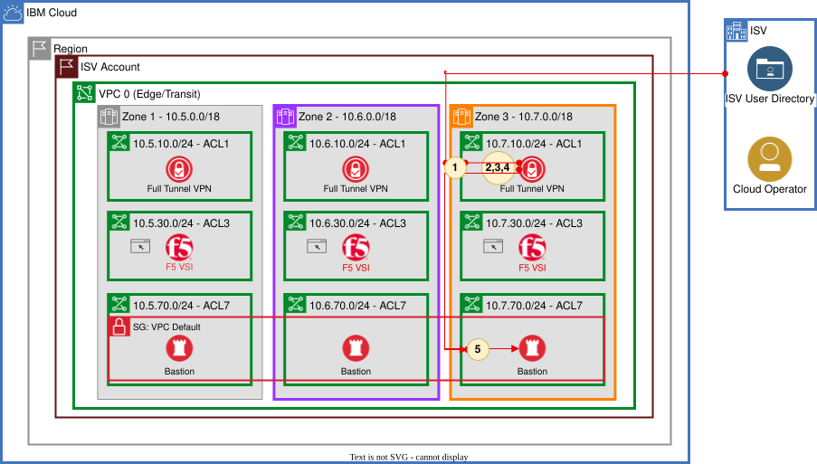{: caption="Cloud administrator access (privileged)" caption-side="bottom"}

### Security enforcements
{: #cloud-admin-enforcements}

The following security enforcements are in place for cloud administrator access:

1. VPC network ACLs:   Allow IP addresses only from the ISV network.

2. Security groups:   Allow connections only from the ISV network.

3. Client-to-site VPN:   Has a public IP but is protected by ACLs and security groups. Requires IAM user credentials and/or certificate-based authentication.

4. IAM access control:   Users need IAM access for VPN and bastion host (SSH) access.

5. Bastion host:   Records all activities performed by privileged users.

6. Geographic restrictions:   {{site.data.keyword.cloud_notm}} blocks traffic from embargo countries.

### Threat mitigation
{: #cloud-admin-threats}

Unauthorized access
:   Only IAM-authorized users can connect to the VPN. ACLs and security groups allow access only from the ISV's CIDR ranges.

Exfiltration attempts
:   VPN connections are logged by {{site.data.keyword.at_short}}. Bastion hosts log all activity and create recordings.

### Architectural decisions
{: #cloud-admin-decisions}

* Use appropriate ACLs and security groups to restrict access
* Send audit logs from bastion hosts to SIEM
* Send {{site.data.keyword.at_short}} events to SIEM

## Application administrator access (privileged)
{: #app-admin-access}

Application administrators access the application's administrative interface through the internet with enhanced security controls.

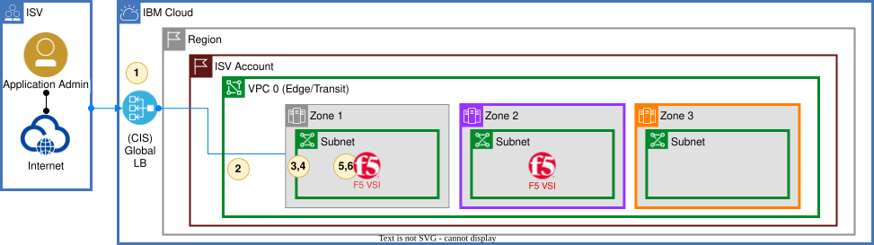{: caption="Application administrator access (privileged)" caption-side="bottom"}

### Security enforcements
{: #app-admin-enforcements}

The following security enforcements are in place for application administrator access:

1. {{site.data.keyword.cis_short}}:   Provides Layer 3 DDoS protection, DNSSec, IP firewall (ASN/Region/CIDR filtering), and load balancing.

2. VPC network ACLs:   Allow IP addresses only from {{site.data.keyword.cis_short}}.

3. Security groups:   Allow connections only from {{site.data.keyword.cis_short}} to F5.

4. F5 public IP: network connections restricted by ACL and security groups

5. F5 capabilities: L7 WAF, DDoS, TLS termination, Access Policy

6. F5 access policies:   Can determine if the accessed page is an admin page and apply appropriate policies.

7. Geographic restrictions:   {{site.data.keyword.cloud_notm}} blocks traffic from embargo countries.

### Threat mitigation
{: #app-admin-threats}

Unauthorized access
:   Allow privileged users to access admin functions only through a bastion host when using VPN access.

### Architectural decisions
{: #app-admin-decisions}

* Forward application audit logs to SIEM
* If the application has a dedicated URL for admin access, consider routing admin traffic through VPN instead of F5
* If the application does not have a dedicated URL for admin access, use role-based access control (RBAC) at the application level

## Cloud console access
{: #cloud-console-access}

Cloud administrators access the {{site.data.keyword.cloud_notm}} console through the internet with multiple security layers.

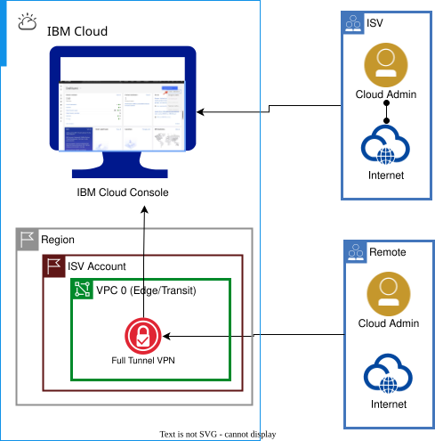{: caption="Cloud console access" caption-side="bottom"}

### Security enforcements
{: #console-enforcements}

The following security enforcements are in place for console access:

Account settings
:   Allow access only from ISV network IP addresses.

IAM access control
:   Provides specific access to appropriate access groups (operators). Individual access policies are not used.

Multi-factor authentication
:   2FA is enforced for all users.

Access groups
:   All permissions are managed through access groups, not individual policies.

{{site.data.keyword.at_short}}
:   Logs all changes to resources and provides audit logging for HTTPS access and API calls.

Separation of duties
:   Platform access and service access can be separated.

Geographic restrictions
:   {{site.data.keyword.cloud_notm}} blocks traffic from embargo countries.

### Threat mitigation
{: #console-threats}

Rogue user from ISV
:   Must originate from ISV IP range, have IAM credentials, pass 2FA, have IAM platform permissions, and have IAM service permissions. All actions generate {{site.data.keyword.at_short}} events for SIEM alerting.

Remote or distributed employees
:   Must use full tunnel VPN into ISV enterprise network to access the cloud console. Non-ISV IP range access is denied. Administrators can also access through client-to-site VPN to bastion host, then to cloud console.

### Architectural decisions
{: #console-decisions}

* Maintain an allow list of IP addresses from which the console can be accessed
* Configure services with the same IP restrictions using Context-based restrictions (CBR)
* Administrators can access from:
   * ISV internal network
   * Client-to-site VPN connection, then to {{site.data.keyword.cloud_notm}} console
* Add customer IP addresses to allow list for customer users to view tickets on the console

## Transit Gateway connectivity (same account)
{: #transit-gateway-same-account}

Transit Gateway enables connectivity between VPCs within the same account with security controls.

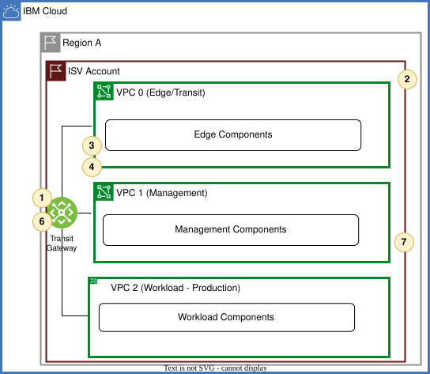{: caption="Transit Gateway connectivity (same account)" caption-side="bottom"}

### Security enforcements
{: #tgw-same-enforcements}

The following security enforcements are in place for Transit Gateway connectivity within the same account:

1. Prefix filtering:   Use Transit Gateway prefix filtering to limit which address prefixes are shared between VPCs.

2. {{site.data.keyword.at_short}}:   Logs all changes to resources and provides audit logging.

3. Network segmentation:   Isolate sensitive data and limit the impact of potential breaches.

4. Access controls:   Use security groups, network ACLs, and IAM policies to restrict access to sensitive data.

5. Encryption:   Ensure data in transit is encrypted.

6. Local Transit Gateway:   Use local Transit Gateway for regional deployments.

7. Flow logs analysis:   Analyze flow logs using SIEM to ensure source and destination IP addresses are from known CIDR ranges.

### Threat mitigation
{: #tgw-same-threats}

Inadvertent data sharing
:   Sensitive data might be inadvertently shared across VPCs due to misconfigured Transit Gateway connections. Use prefix filtering and network segmentation to prevent this.

Unauthorized data access
:   Unauthorized applications or services might leverage Transit Gateway to access and exfiltrate data. Use security groups, ACLs, and flow log analysis to detect and prevent unauthorized access.

## Transit Gateway connectivity (cross-account)
{: #transit-gateway-cross-account}

Transit Gateway enables connectivity between VPCs across different accounts with additional security controls.

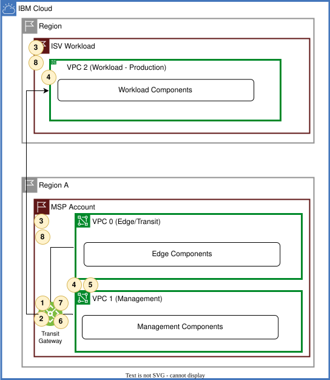{: caption="Transit Gateway connectivity (same account)" caption-side="bottom"}

### Security enforcements
{: #tgw-cross-enforcements}

The following security enforcements are in place for cross-account Transit Gateway connectivity:

1. Connection approval:   Cross-account Transit Gateway connections must be requested and accepted by both accounts.

2. Prefix filtering:   Use Transit Gateway prefix filtering to limit which address prefixes are shared between accounts.

3. {{site.data.keyword.at_short}}:   Logs all changes to resources and provides audit logging. For more information, see [Activity Tracker events for Transit Gateway](/docs/transit-gateway?topic=transit-gateway-at_events).

4. Network segmentation:   Isolate sensitive data and limit the impact of potential breaches.

5. Access controls:   Use security groups, network ACLs, and IAM policies to restrict access to sensitive data.

6. Encryption:   Ensure data in transit is encrypted.

7. Local Transit Gateway:   Use local Transit Gateway for tregional deployments.

8. Flow logs analysis:   Analyze flow logs using SIEM to ensure source and destination IP addresses are from known CIDR ranges.

### Architectural decisions
{: #tgw-cross-decisions}

* Use of cross-account connectivity using Transit Gateway is discouraged and requires addictional justifications
* Enabling cross-account Transit Gateway connectivity can be tracked by [{{site.data.keyword.at_short}}](/docs/transit-gateway?topic=transit-gateway-at_events)

### Threat mitigation
{: #tgw-cross-threats}

Inadvertent data sharing
:   Sensitive data might be inadvertently shared across VPCs in different accounts due to misconfigured Transit Gateway connections. Use prefix filtering, connection approval process, and network segmentation to prevent this.

Unauthorized data access
:   Unauthorized applications or services might leverage Transit Gateway to access and exfiltrate data. Use security groups, ACLs, and flow log analysis to detect and prevent unauthorized access.

## Public Gateway access
{: #public-gateway-access}

Public Gateway enables outbound internet connectivity from VPC resources with security controls.

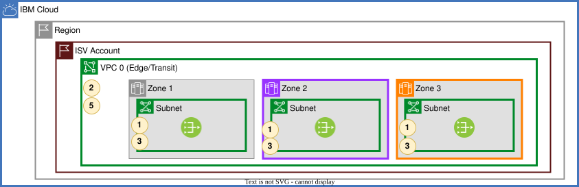{: caption="Public Gateway access" caption-side="bottom"}

### Security enforcements
{: #pgw-enforcements}

The following security enforcements are in place for Public Gateway access:

1. Access controls:   Use security groups, network ACLs, and IAM policies to restrict access.

2. {{site.data.keyword.at_short}}:   Logs all changes to resources and provides audit logging.

3. Encryption in transit:   Only allow outbound connections with encryption in transit when outbound connections are needed.

4. Alternative approaches:   For sites that do not publish CIDR ranges, assets should be made available using an alternative approach.

5. Security and Compliance Center:   Checks for rules that do not allow access to 0.0.0.0/0 with any port, ensuring specific IP addresses or CIDR ranges are used.

6. Geographic restrictions:   {{site.data.keyword.cloud_notm}} blocks traffic from embargo countries.

### Threat mitigation
{: #pgw-threats}

Insider data exfiltration
:   Insiders with access to instances connected to the internet can intentionally or unintentionally transfer sensitive data outside the organization. Use security groups, ACLs, and monitoring to detect and prevent unauthorized data transfers.

Unauthorized data transfer
:   Unauthorized applications or services might leverage the Public Gateway to send data to external destinations without proper oversight. Use flow log analysis and SIEM monitoring to detect unauthorized transfers.

### Architectural decisions
{: #pgw-decisions}

* Consider using an [egress proxy](/docs/framework-financial-services?topic=framework-financial-services-vpc-architecture-egress-proxy) to filter based on URL and domain
* Minimize the number of subnets with access to Public Gateway to mitigate risk

## Client-to-site VPN access
{: #client-to-site-vpn}

Client-to-site VPN enables ISV administrators to connect to cloud resources from remote locations.

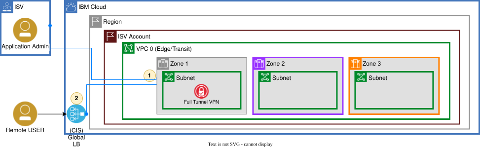{: caption="Client-to-site VPN access" caption-side="bottom"}

### Security enforcements
{: #c2s-enforcements}

The following security enforcements are in place for client-to-site VPN access:

1. Network ACLs:   Limit client connections to ISV on-premises networks and {{site.data.keyword.cis_short}}.

2. {{site.data.keyword.cis_short}} routing:   For remote locations, route the client-to-site VPN through {{site.data.keyword.cis_short}} and use IP firewall to filter by IP, ASN, or region.

3. Access controls:   Ensure correct ACLs and security groups are applied to allow access to resources for VPN users.

4. Geographic restrictions:   {{site.data.keyword.cloud_notm}} blocks traffic from embargo countries.

### Threat mitigation
{: #c2s-threats}

Insider data misuse
:   Employees with legitimate VPN access might misuse their access to transfer sensitive data outside the organization. Use monitoring, logging, and access controls to detect and prevent misuse.

Remote work risks
:   Remote work environments might lack adequate supervision, increasing the risk of data misuse. Implement endpoint security controls and monitoring.

### Architectural decisions
{: #c2s-decisions}

* All internet-exposed interfaces must be restricted to {{site.data.keyword.cis_short}}, with exceptions for site-to-site VPN
* Consider an assessment check for laptop encryption to secure critical data like VPN certificates

## Site-to-site VPN access (ISV to cloud)
{: #site-to-site-vpn-isv}

Site-to-site VPN enables secure connectivity between ISV on-premises networks and cloud resources.

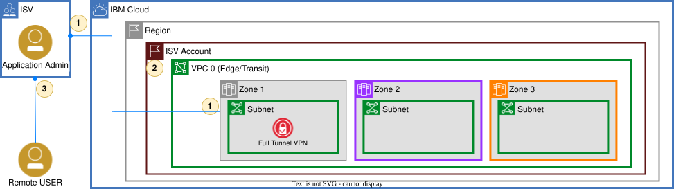{: caption="Site-to-site VPN access (ISV to cloud)" caption-side="bottom"}

### Security enforcements
{: #s2s-isv-enforcements}

The following security enforcements are in place for site-to-site VPN access:

1. Peer IP restrictions:   Site-to-site connections are limited based on peer IP addresses.

2. {{site.data.keyword.at_short}}:   Changes to the connection resource can be tracked by {{site.data.keyword.at_short}}.

3. Network routing:   Remote users connect to on-premises ISV VPN and then can connect to cloud VPC resources with appropriate routing.

### Threat mitigation
{: #s2s-isv-threats}

Insider data misuse
:   Employees with legitimate VPN access might misuse their access to transfer sensitive data outside the organization. Use monitoring, logging, and access controls to detect and prevent misuse.

Remote work risks
:   Remote work environments might lack adequate supervision, increasing the risk of data misuse. Implement endpoint security controls and monitoring.

### Architectural decisions
{: #s2s-isv-decisions}

* During Financial Services assessment, ISV must demonstrate how they handle security restrictions to minimize access to {{site.data.keyword.cloud_notm}} account
* Define controls for using VPN for machine-to-machine flows

## Site-to-site VPN access (service consumer to cloud)
{: #site-to-site-vpn-customer}

Site-to-site VPN enables secure connectivity between service consumer on-premises networks and cloud resources.

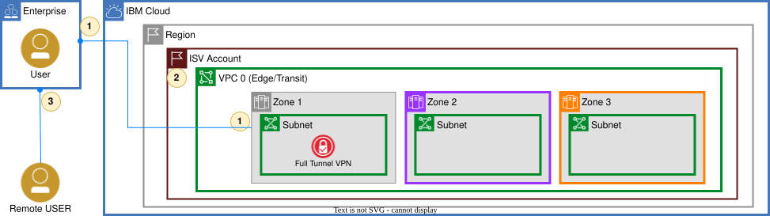{: caption="Site-to-site VPN access (service consumer to cloud)" caption-side="bottom"}

### Security enforcements
{: #s2s-customer-enforcements}

The following security enforcements are in place for customer site-to-site VPN access:

1. Peer IP restrictions:   Site-to-site connections are limited based on peer IP addresses.

2. {{site.data.keyword.at_short}}:   Changes to the connection resource can be tracked by {{site.data.keyword.at_short}}.

3. Network routing:   Remote users connect to on-premises customer VPN and then can connect to cloud VPC resources with appropriate routing.

### Threat mitigation
{: #s2s-customer-threats}

Insider data misuse
:   Employees with legitimate VPN access might misuse their access to transfer sensitive data outside the organization. Use monitoring, logging, and access controls to detect and prevent misuse.

Remote work risks
:   Remote work environments might lack adequate supervision, increasing the risk of data misuse. Implement endpoint security controls and monitoring.

## {{site.data.keyword.dl_short}} connectivity
{: #direct-link}

{{site.data.keyword.dl_short}} provides dedicated, private connectivity between on-premises networks and {{site.data.keyword.cloud_notm}}.

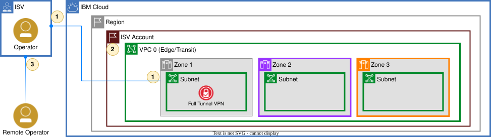{: caption="{{site.data.keyword.dl_short}} connectivity" caption-side="bottom"}

### Security enforcements
{: #dl-enforcements}

The following security enforcements are in place for {{site.data.keyword.dl_short}} connectivity:

1. Peer IP restrictions:   {{site.data.keyword.dl_short}} connections are limited based on peer IP addresses configured at the point of presence (PoP).

2. {{site.data.keyword.at_short}}:   Changes to the connection resource can be tracked by {{site.data.keyword.at_short}}.

3. Network routing:   Remote users connect to on-premises ISV VPN and then can connect to cloud VPC resources with appropriate routing.

### Threat mitigation
{: #dl-threats}

Insider data misuse
:   Employees with legitimate {{site.data.keyword.dl_short}} access might misuse their access to transfer sensitive data outside the organization. Use monitoring, logging, and access controls to detect and prevent misuse.

Remote work risks
:   Remote work environments might lack adequate supervision, increasing the risk of data misuse. Implement endpoint security controls and monitoring.

### Architectural decisions
{: #dl-decisions}

* Similar to site-to-site VPN, define how the access through {{site.data.keyword.dl_short}} is restricted
* Establish audit procedures to verify access controls

## ISV - Application Deployment
{: #app-deployment}

{: caption="ISV - Application Deployment" caption-side="bottom"}

### High availability considerations
{: #high-availability}

The following high availability patterns are recommended for ISV deployments:

Workload VPC
:   Deploy across 2 or 3 availability zones depending on required SLA.

Management VPC
:   Deploy across 2 availability zones.

Edge VPC
:   Deploy across 2 availability zones. Public application load balancers are deployed in active-active mode. Optionally, use separate Edge VPCs for critical and non-critical workloads. The Edge VPC hosts application load balancers, bastion hosts, and VPN gateways.

{{site.data.keyword.cis_short}}
:   Deploy WAF and global load balancer with {{site.data.keyword.cis_short}}.

### Cloud service access
{: #cloud-service-access}

All {{site.data.keyword.cloud_notm}} services are accessed from VPCs using Virtual Private Endpoints (VPEs). VPEs are deployed for each VPC to ensure private connectivity to cloud services.

## Next steps
{: #next-steps}

* [Working with virtual servers in VPC reference architecture](/docs/framework-financial-services?topic=framework-financial-services-shared-compute-vsi)
