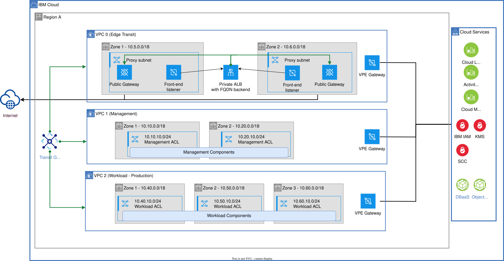
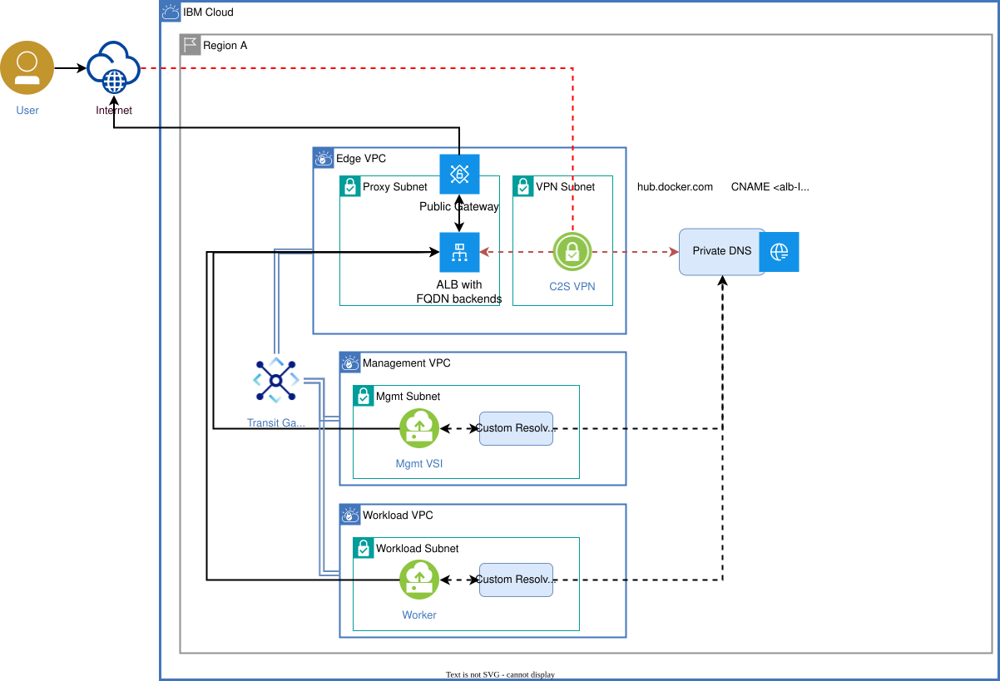
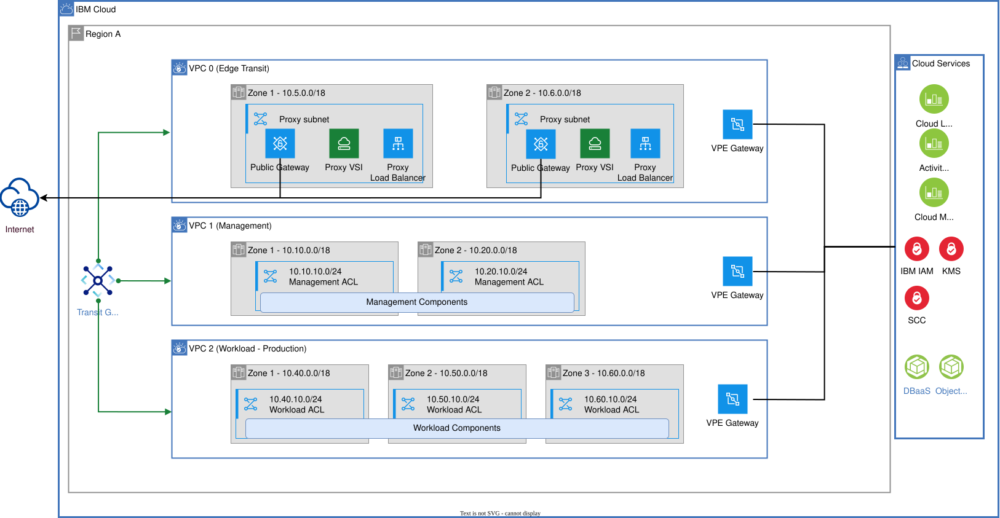
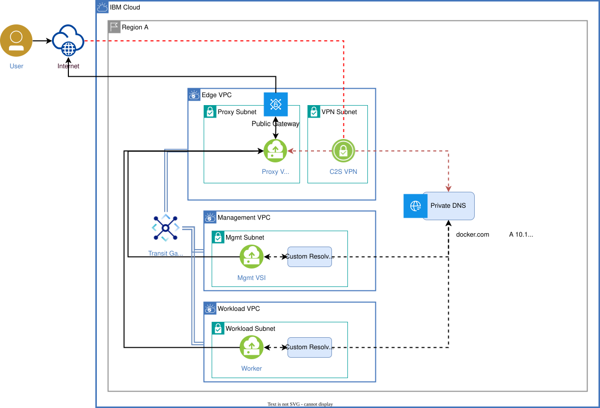
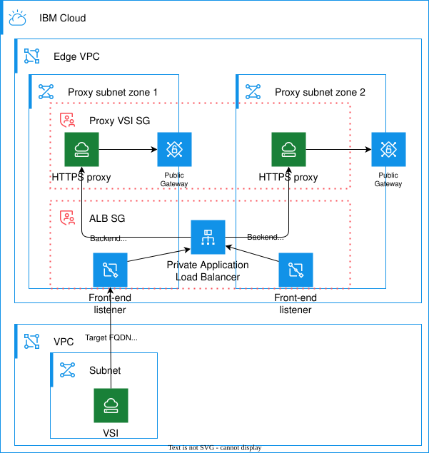

---

copyright:
  years: 2020, 2026
lastupdated: "2026-10-06"

keywords:

subcollection: framework-financial-services

---

{{site.data.keyword.attribute-definition-list}}

# FQDN based egress proxy in IBM Cloud VPC
{: #vpc-architecture-egress-proxy}


## Problem statement
{: #problem-statement}

FS controls require SG and ACL to not have 0.0.0.0/0 for egress rules. However, some services on internet do not provide specific IP ranges like docker or google, and which are used by ISVs for several purposes from container registry to federation with authentication provider. In high security environments, having an egress for 0.0.0.0/0 is not acceptable. The solution architecture must provide a way to access public services on the internet which do not publish IP Address from isolated secured environments on cloud and still be able to meet FS controls with minimal exceptions.
{: shortdesc}

## Assumptions
{: #problem-statement}

- At least 1 subnet with bidirectional ACL of 0.0.0.0/0 will be allowed
- At least 1 SG with outgoing rule of 0.0.0.0/0 will be allowed
- Acceptance of increased cost with all internet traffic traversing across Transit GW instead of directly from public GW.
- PGWs can continue to be used in each VPC subnet where the Ips are known and can by specified in ACL/SGs
- Default routing is managed by VPC internally.
- Custom resolver is managed by Private DNS offering

## Scope and goals
{: #scope-and-goals}

- Managed solution based on VPC ALB features.
- This guide is only focusing on technical feasibility of an approach. HA considerations must be taken care of on per application basis.
- (Optional) HAProxy has been used to implement TCP passthrough proxy

## Workload to Internet Connectivity – Application Load Balancer as Transparent Proxy
{: #alb-fqdn-proxy}

- Deploy a dedicated subnet for hosting the proxy in the Edge VPC. Allow 0.0.0.0/0 on the associated ACL. Only the outgoing SG will have to be configured with 0.0.0.0/0:443 rule.
- This will be marked by SCC and will have to be accepted as an exception.
- The Application Load Balancer acting as a proxy must be configured for allowed FQDNs approved by the organization (for example, api.github.com)
- Access to services that do not have permanent IP ranges, must use the ALB.
- For more details refer to [public internet access guide](/docs/framework-financial-services?topic=framework-financial-services-vpc-architecture-connectivity-to-internet)

{: caption="ALB proxy solution overview" caption-side="bottom"}


## Alternatives to ALB egress proxy
{: #alternatives}

This guide is focused on implementing an egress proxy using a managed VPC ALB with backends configured for each endpoint FQDN. In some cases, you may consider BYO solutions that will follow similar architecture pattern but use a self-managed component instead of VPC ALB:

- [TCP Passthrough using HAProxy](#byo-proxy) with domain based Allow list using SNI headers + Private DNS
  - Does not require any application customization or operating system settings change or networking change in the VPC.
  - This option provides more flexibility with URL and domain name filtering and may be required for endpoint with varying FQDNs.
- Squid (or F5) as a forward HTTP / Socks proxy with domain-based ACL
  - Needs application to support proxy setup or being able to configure the proxy at operating system settings.
- Squid (or F5) transparent proxy as a Default GW with domain-based ACL
  - Needs all the internal VPCs to still have subnets with bidirectional ACLs to allow 0.0.0.0/0(even though no route to internet exists) which will get flagged by SCC. While secure, it is not FS compliant and will fail SCC checks.

## High level architecture
{: #high-level-architecture}

{: caption="High level architecture" caption-side="bottom"}

All requests to public service endpoints without a DNS alias fail, since there is no public gateway in Management or Workload VPC and hence no route to Internet. Only way to reach the internet is through Edge VPC's ALB, which implements a set of backend for FQDNs on allow-list.

**Note**: Client-to-site VPN is included in the diagram for completeness but is not required for the proxy to function as a firewall. Its primary purpose is to enable access to the isolated environment. Additionally, in accordance with FS controls, the VPN must operate as a full-tunnel VPN. As a result, the proxy will also facilitate controlled internet access for operators connected via VPN, when necessary.

## Private DNS configuration
{: #private-dns}

- [DNS Services](/catalog/services/dns-services) instance must be configured in at least one VPC within the cloud account to provide DNS resolution overrides for the target domains.
- Create a DNS zone in the DNS Services instance for each top-level domain that needs to be accessed via the egress proxy.
- The allowed endpoints' subdomains should be configured as `CNAME` records pointing to the ALB's hostname. For example, within a private zone for `github.com`, create a record like `api    CNAME xxxxxxx-us-south.lb.appdomain.cloud`.
- For each DNS zone configure permitted subnets that will access the external resources via egress proxy. Do not add the subnet(s) where the proxy VSI resides.
- ICR access: if a VPE for ICR is provisioned within a VPC, the default VPC DNS resolver already points public ICR FQDN to the IBM Cloud private IP addresses, so there is no need to override or proxy connections to the ICR endpoints.
- [Restricted DNS zones](/docs/dns-svcs?topic=dns-svcs-managing-dns-zones&interface=ui#restricted-dns-zone-names): certain domain zones are not allowed in DNS Services for security and/or platform stability reasons. In most cases egress access to resources with the FQDNs in these zones can be arranged in a different way - e.g. container image mirroring for image registries such as quay.io or registry.redhat.io, or using forwarding proxy mode for applications that support proxy configuration. In case where none of the alternative access options are feasible, a custom resolver has to be configured in the DNS Services for each subnet that needs access to the resource with a restricted FQDN. The custom resolver should have a matching rule for the restricted FQDN and forward the query to a custom DNS instance (e.g. a BIND name service running on a VSI) that will resolve the FQDN to the egress proxy VSI IP address.

If you need to provide access to the endpoint using the zone name domain (for example `npmjs.org`), you cannot use a `CNAME` record, only an `A` record pointing to an IP address. In this case you will need to configure a private path load balancer in addition to the proxy ALB to avoid pointing the DNS entry directly to an ALB IP address which may change. See Pattern 2 in [ALB for Filtering Egress Traffic](https://community.ibm.com/community/user/blogs/matt-mulsow/2026/09/17/alb-for-filtering-egress-traffic-by-hostname) blog.
{: important}

### ALB configuration example
{: #alb-example}

For a complete guide on configuring an ALB with FQDN based backends, see [ALB for Filtering Egress Traffic](https://community.ibm.com/community/user/blogs/matt-mulsow/2026/09/17/alb-for-filtering-egress-traffic-by-hostname) blog. The recommended option there is Pattern 1 which places the egress ALB in a separate Edge VPC.

* Make sure to configure DNS entries as described in the previous section if you are using subdomain names in the zones configured for your endpoints.
* When configuring the ACL and SG for the proxy subnet, ensure the traffic to the DNS ranges is allowed (see (example)[#acls] below).
* For FQDN based backends ensure that the health check endpoint you are planning to use returns the response code you configure. Some top-level endpoint may return codes `30x` when no path is used. Provide proper health check configuration at the time of creating the backend pool, otherwise you may encounter issues trying to change it later and will have to recreate the backend pool.

If you need to provide access to the endpoint using the zone name domain (for example npmjs.org), you will need to provision a Private Path Network Load Balancer (PPNLB) and a Virtual Private Endpoint (VPE) for it. Your Cloud DNS zones will be pointed to a VPE instead of ALB's hostname to avoid the issue of changing ALB's IP addresses. See Pattern 2 in [ALB for Filtering Egress Traffic](https://community.ibm.com/community/user/blogs/matt-mulsow/2026/09/17/alb-for-filtering-egress-traffic-by-hostname) blog.
{: important}


## HA considerations
{: #ha-considerations}

Using a VPC Application Load Balancer as an egress proxy takes advantage of the ALB HA and autoscaling features without extra effort. Make sure to follow the [VPC ALB documentation steps](/docs/vpc?topic=vpc-load-balancers-about&interface=ui#ha-and-alb) for proper ALB deployment by assigning the ALB to more than one subnet.

## Networking configuration examples
{: #network-flow-controls}

### Access control lists
{: #acls}

#### Edge internet proxy subnet ACL (edge-internet-proxy-acl)

##### Inbound rules

| Name | Rule Priority | Allow or Deny | Protocol | Source | Destination | Value |
|------|---------------|---------------|----------|---------|-------------|-------|
| inbound-tcp | 1 | Allow | TCP | Any IP, any port | 10.0.0.0/8, ports 1024-65535 | — |
| inbound-dns | 2 | Allow | UDP | 161.26.0.0/16, port 53 | 10.0.0.0/8, any port | — |
| inbound-dns-tcp | 3 | Allow | TCP | 161.26.0.0/16, port 53 | 10.0.0.0/8, any port | — |
| inbound-vpc-to-vpc | 4 | Allow | ICMP-TCP-UDP | 10.0.0.0/8 | 10.0.0.0/8 | — |
{: caption="Edge internet proxy subnet ACL - inbound rules" caption-side="bottom"}

##### Outbound rules

| Name | Rule Priority | Allow or Deny | Protocol | Source | Destination | Value |
|------|---------------|---------------|----------|---------|-------------|-------|
| outbound-tcp | 1 | Allow | TCP | 10.0.0.0/8, ports 1024-65535 | Any IP, port 443 | — |
| outbound-dns | 2 | Allow | UDP | 10.0.0.0/8, any port | 161.26.0.0/16, port 53 | — |
| outbound-dns-tcp | 3 | Allow | TCP | 10.0.0.0/8, any port | 161.26.0.0/16, port 53 | — |
| outbound-vpc-to-vpc | 4 | Allow | ICMP-TCP-UDP | 10.0.0.0/8 | 10.0.0.0/8 | — |
{: caption="Edge internet proxy subnet ACL - outbound rules" caption-side="bottom"}

#### Management subnet ACL (mgmt-acl)

##### Inbound rules

| Name | Rule Priority | Allow or Deny | Protocol | Source | Destination | Value |
|------|---------------|---------------|----------|---------|-------------|-------|
| inbound-iaas | 1 | Allow | ICMP-TCP-UDP | 161.26.0.0/16 | 10.0.0.0/8 | — |
| inbound-cse | 2 | Allow | ICMP-TCP-UDP | 166.8.0.0/14 | 10.0.0.0/8 | — |
| inbound-vpc | 3 | Allow | ICMP-TCP-UDP | 10.0.0.0/8 | 10.0.0.0/8 | — |
{: caption="Management subnet ACL - inbound rules" caption-side="bottom"}

##### Outbound rules

| Name | Rule Priority | Allow or Deny | Protocol | Source | Destination | Value |
|------|---------------|---------------|----------|---------|-------------|-------|
| outbound-iaas | 1 | Allow | ICMP-TCP-UDP | 10.0.0.0/8 | 161.26.0.0/16 | — |
| outbound-cse | 2 | Allow | ICMP-TCP-UDP | 10.0.0.0/8 | 166.8.0.0/14 | — |
| outbound-vpc | 3 | Allow | ICMP-TCP-UDP | 10.0.0.0/8 | 10.0.0.0/8 | — |
{: caption="Management subnet ACL - outbound rules" caption-side="bottom"}

#### Client-to-site VPN subnet ACL (edge-vpn-acl)

##### Inbound rules

| Name | Rule Priority | Allow or Deny | Protocol | Source | Destination | Value |
|------|---------------|---------------|----------|---------|-------------|-------|
| inbound-internet | 1 | Allow | UDP | Any IP, any port | 10.0.0.0/8, port 443 | — |
| inbound-iaas | 2 | Allow | ICMP-TCP-UDP | 161.26.0.0/16 | 10.0.0.0/8 | — |
| inbound-cse | 3 | Allow | ICMP-TCP-UDP | 166.8.0.0/14 | 10.0.0.0/8 | — |
| inbound-vpc | 4 | Allow | ICMP-TCP-UDP | 10.0.0.0/8 | 10.0.0.0/8 | — |
{: caption="Client-to-site VPN subnet ACL - inbound rules" caption-side="bottom"}

##### Outbound rules

| Name | Rule Priority | Allow or Deny | Protocol | Source | Destination | Value |
|------|---------------|---------------|----------|---------|-------------|-------|
| outbound-internet | 1 | Allow | UDP | 10.0.0.0/8, port 443 | Any IP, any port | — |
| outbound-iaas | 2 | Allow | ICMP-TCP-UDP | 10.0.0.0/8 | 161.26.0.0/16 | — |
| outbound-cse | 3 | Allow | ICMP-TCP-UDP | 10.0.0.0/8 | 166.8.0.0/14 | — |
| outbound-vpc | 4 | Allow | ICMP-TCP-UDP | 10.0.0.0/8 | 10.0.0.0/8 | — |
{: caption="Client-to-site VPN subnet ACL - outbound rules" caption-side="bottom"}

#### Workload subnet ACL (wrkld-acl)

##### Inbound rules

| Name | Rule Priority | Allow or Deny | Protocol | Source | Destination | Value |
|------|---------------|---------------|----------|---------|-------------|-------|
| inbound-iaas | 1 | Allow | ICMP-TCP-UDP | 161.26.0.0/16 | 10.0.0.0/8 | — |
| inbound-cse | 2 | Allow | ICMP-TCP-UDP | 166.8.0.0/14 | 10.0.0.0/8 | — |
| inbound-vpc | 3 | Allow | ICMP-TCP-UDP | 10.0.0.0/8 | 10.0.0.0/8 | — |
{: caption="Workload subnet ACL - inbound rules" caption-side="bottom"}

##### Outbound rules

| Name | Rule Priority | Allow or Deny | Protocol | Source | Destination | Value |
|------|---------------|---------------|----------|---------|-------------|-------|
| outbound-iaas | 1 | Allow | ICMP-TCP-UDP | 10.0.0.0/8 | 161.26.0.0/16 | — |
| outbound-cse | 2 | Allow | ICMP-TCP-UDP | 10.0.0.0/8 | 166.8.0.0/14 | — |
| outbound-vpc | 3 | Allow | ICMP-TCP-UDP | 10.0.0.0/8 | 10.0.0.0/8 | — |
{: caption="Workload subnet ACL - outbound rules" caption-side="bottom"}


### Security groups
{: #security-groups}

#### Egress Proxy Security Group (egress-proxy-sg)

##### Inbound rules

| Protocol | Source Type | Source | Destination Type | Destination | Value |
|----------|-------------|---------|------------------|-------------|-------|
| TCP | CIDR block | 10.0.0.0/8 | CIDR block | 10.0.0.0/8 | Port 443 |
{: caption="Egress Proxy Security Group - inbound rules" caption-side="bottom"}

##### Outbound rules

| Protocol | Source Type | Source | Destination Type | Destination | Value |
|----------|-------------|---------|------------------|-------------|-------|
| ICMP-TCP-UDP | CIDR block | 10.0.0.0/8 | CIDR block | 166.8.0.0/14 | — |
| ICMP-TCP-UDP | CIDR block | 10.0.0.0/8 | CIDR block | 161.26.0.0/16 | — |
| TCP | CIDR block | 10.0.0.0/8 | Any | 0.0.0.0/0 | Port 443 |
{: caption="Egress Proxy Security Group - outbound rules" caption-side="bottom"}

#### Management resources Security Group (mgmt-sg)

##### Inbound rules

| Protocol | Source Type | Source | Destination Type | Destination | Value |
|----------|-------------|---------|------------------|-------------|-------|
| ICMP-TCP-UDP | CIDR block | 10.0.0.0/8 | CIDR block | 10.0.0.0/8 | — |
{: caption="Management resources Security Group - inbound rules" caption-side="bottom"}

##### Outbound rules

| Protocol | Source Type | Source | Destination Type | Destination | Value |
|----------|-------------|---------|------------------|-------------|-------|
| ICMP-TCP-UDP | CIDR block | 10.0.0.0/8 | CIDR block | 161.26.0.0/16 | — |
| ICMP-TCP-UDP | CIDR block | 10.0.0.0/8 | CIDR block | 10.0.0.0/8 | — |
| ICMP-TCP-UDP | CIDR block | 10.0.0.0/8 | CIDR block | 166.8.0.0/14 | — |
{: caption="Management resources Security Group - outbound rules" caption-side="bottom"}


#### Client-to-site VPN Security Group (c2svpn-sg)

##### Inbound rules

| Protocol | Source Type | Source | Destination Type | Destination | Value |
|----------|-------------|---------|------------------|-------------|-------|
| UDP | Any | 0.0.0.0/0 | CIDR block | 10.0.0.0/8 | Port 443 |
{: caption="Client-to-site VPN Security Group - inbound rules" caption-side="bottom"}

##### Outbound rules

| Protocol | Source Type | Source | Destination Type | Destination | Value |
|----------|-------------|---------|------------------|-------------|-------|
| ICMP-TCP-UDP | CIDR block | 10.0.0.0/8 | CIDR block | 10.0.0.0/8 | — |
| ICMP-TCP-UDP | CIDR block | 10.0.0.0/8 | CIDR block | 161.26.0.0/16 | — |
{: caption="Client-to-site VPN Security Group - outbound rules" caption-side="bottom"}

#### Workload resources security group (wrkld-sg)

##### Inbound rules

| Protocol | Source Type | Source | Destination Type | Destination | Value |
|----------|-------------|---------|------------------|-------------|-------|
| ICMP-TCP-UDP | CIDR block | 10.0.0.0/8 | CIDR block | 10.0.0.0/8 | — |
{: caption="Workload resources security group - inbound rules" caption-side="bottom"}

##### Outbound rules

| Protocol | Source Type | Source | Destination Type | Destination | Value |
|----------|-------------|---------|------------------|-------------|-------|
| ICMP-TCP-UDP | CIDR block | 10.0.0.0/8 | CIDR block | 10.0.0.0/8 | — |
| ICMP-TCP-UDP | CIDR block | 10.0.0.0/8 | CIDR block | 166.8.0.0/14 | — |
| ICMP-TCP-UDP | CIDR block | 10.0.0.0/8 | CIDR block | 161.26.0.0/16 | — |
{: caption="Workload resources security group - outbound rules" caption-side="bottom"}


## Alternative Solution - the BYO Proxy Approach for Services with dynamic IPs
{: #byo-proxy}

- Instead of a VPC ALB, deploy a VSI in the proxy subnet.
- The proxy service running on the VSI must be configured for whitelisting allowed domains approved by the organization (example *.docker.com)
- The proxy can be used as a https proxy.

{: caption="BYO proxy solution overview" caption-side="bottom"}


### BYO Proxy - High level architecture
{: #byo-proxy-high-level-architecture}

{: caption="High level architecture" caption-side="bottom"}

Similar to the ALB approach, all requests to public service endpoints without a DNS alias fail, since there is no public gateway in Management or Workload VPC and hence no route to Internet. Only way to reach the internet is through Edge VPC's TCP Passthrough Proxy, which implements an FQDN allow-list.

### HAProxy configuration example
{: #haproxy-example}

```bash
# Capture SNI for logging and routing
tcp-request inspect-delay 5s
tcp-request content accept if {{ req_ssl_hello_type 1 }}

# ACL to extract SNI hostname
acl valid_sni req.ssl_sni -i -f /etc/haproxy/allowed_hosts.txt
acl has_sni req.ssl_sni -m found

# Capture SNI for logging
tcp-request content capture req.ssl_sni len 64

# Block connections without SNI or not in ACL
tcp-request content reject unless has_sni
tcp-request content reject unless valid_sni

# Route based on SNI to dynamic backend
use_backend %[req.ssl_sni,lower,map(/etc/haproxy/sni_backend.map,txt,default_backend)]
```


### DNS configuration
{: #byo-proxy-private-dns}

- Create a DNS zone in the DNS Services instance for each top-level domain that needs to be accessed via the egress proxy. Add DNS `A` records for each FQDN pointing to the proxy instance.
- For each DNS zone configure permitted subnets that will access the external resources via egress proxy. Do not add the subnet(s) where the proxy VSI resides.


### HA considerations for BYO Proxy
{: #ha-considerations}

- Instance redundancy
  - Deploy additional instances in other zone to eliminate single points of failure and ensure continued service availability in case of a node or host failure.
- Load balancing
  - While DNS round robin can load balance in case of multi-instance deployment but will not provide health check capabilities. Configure a Load Balancer as a Service (LBaaS) in front of the instances to distribute traffic evenly and provide automatic failover capabilities.
- Scalability and performance
  - The load balancer configuration should support horizontal scaling as needed to handle varying workloads or peak usage scenarios.
- Alignment with Availability Objectives
  - The number of instances and load balancing setup should be determined based on defined RTO (Recovery Time Objective), RPO (Recovery Point Objective), and uptime requirements.

### HA Deployment with VPC Application Load Balancers
{: #ha-deployment}

{: caption="High availability configuration for BYO proxy deployment" caption-side="bottom"}

- Follow typical deployment with [VPC Application Load Balancers](/docs/vpc?topic=vpc-load-balancers-about&interface=ui#ha-and-alb) while configuring the VSIs running the proxy component as ALB backend pools.
- Use TCP front-end listener for transparent proxy mode scenario. The private DNS should have CNAME entries for the target external domain pointing to the ALB hostname.
- For transparent proxy listener, [configure policies](/docs/vpc?topic=vpc-layer-7-load-balancing&interface=ui#layer-4-policy) matching the allowed SNI / FQDN - that will give an additional level of control and auditability. Requests to the egress proxy that do not match the target FQDN will result in an SSL error if the default pool is removed. This may cause an SCC ALB rule check failure, so either a dummy backend must be created, or an SCC exception should be added for the ALB handling the proxy traffic.
- For a normal forward proxy mode, it is recommended to set up HTTPS front-end listener with a valid certificate so that the connection to the proxy is properly encrypted. An HTTPS listener can also have policies defined based on HTTP headers, so a destination for a proxy request can be checked as well.
- Using front-end listener policies is not required for make ALB/HA work but it provides an additional layer of security with more visibility at the platform level - as opposed to all configuration encapsulated at the proxy VSI config in its filesystem.
- Define security groups that limit access to the ALB from designated subnets or resources within the VPC. A different security group should restrict traffic to proxy VSI to block direct access to it besides ALB.

## Next steps
{: #next-steps}

* [Working with virtual servers in VPC reference architecture](/docs/framework-financial-services?topic=framework-financial-services-shared-compute-vsi)
